# Diagramy Architektury - Compatibility Matrix

## 📐 Diagram ERD (Entity Relationship Diagram)

### Relacje Tabel

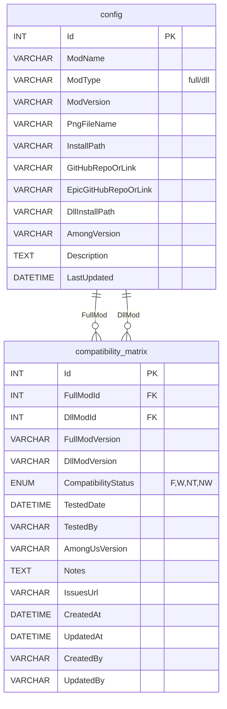

---

## 🔄 Diagram Przepływu Danych

### Use Case 1: Sprawdzenie Kompatybilności

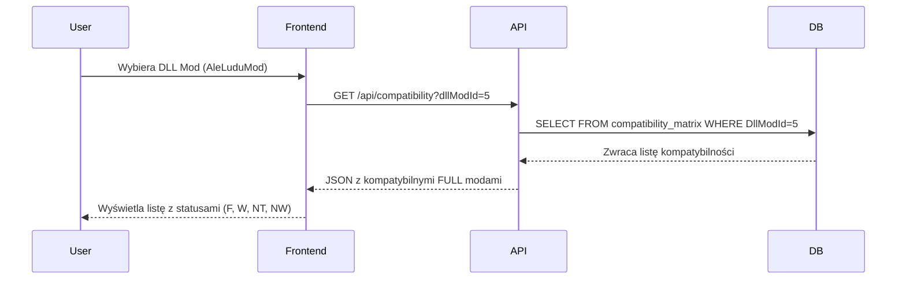

### Use Case 2: Aktualizacja Statusu przez Admina

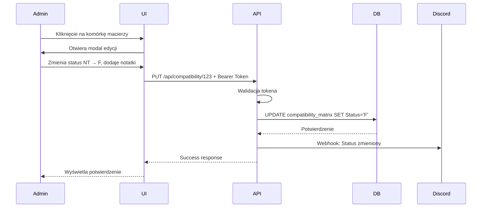

---

## 🏗️ Diagram Architektury Systemu

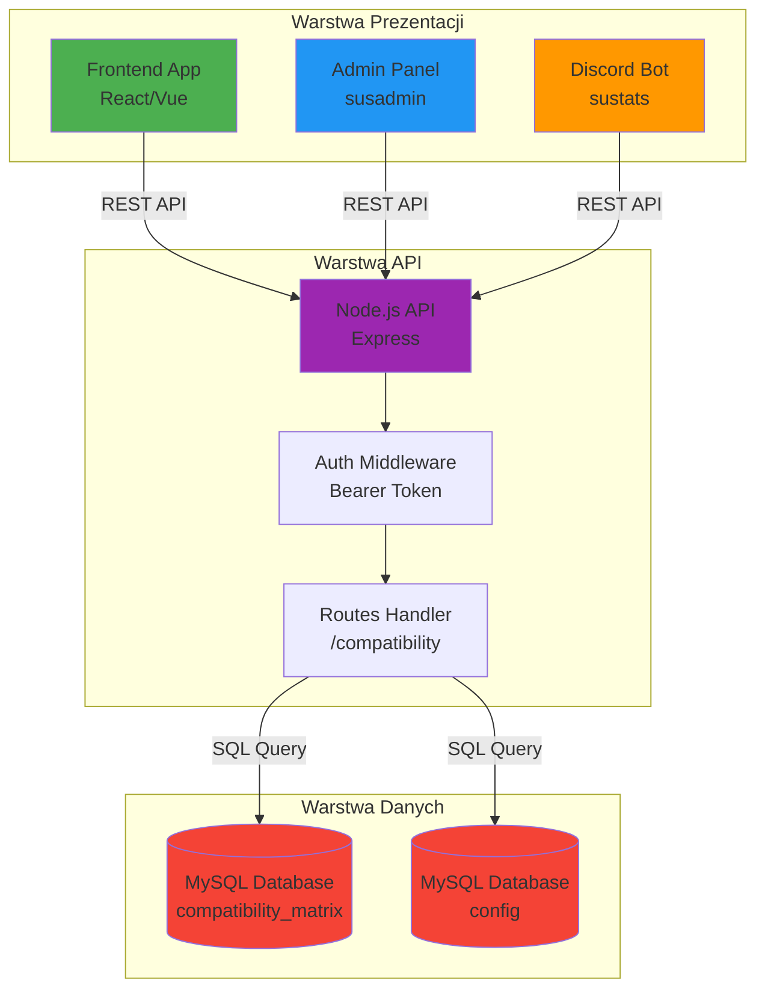

---

## 🔀 Diagram Obsługi Wersji

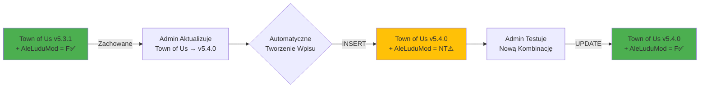

---

## 📊 Diagram Stanów Kompatybilności

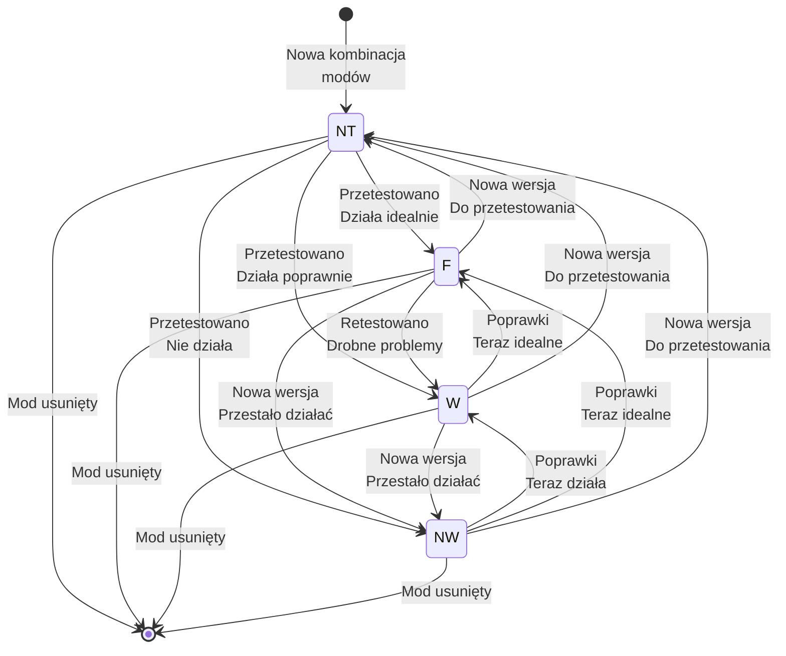

---

## 🎯 Diagram Przypadków Użycia

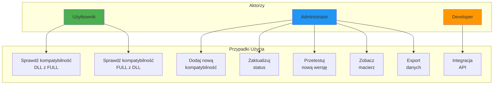

---

## 📈 Diagram Procesu Testowania

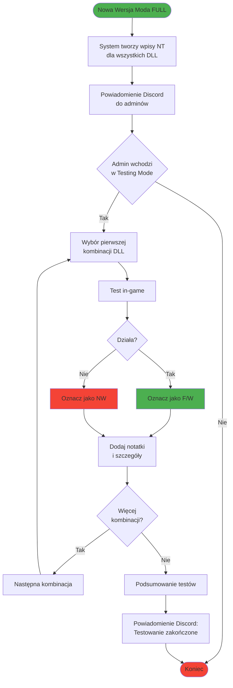

---

## 🗺️ Diagram Interfejsu Użytkownika

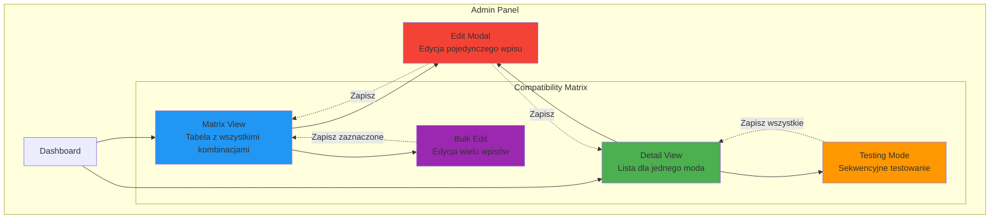

---

## 🔐 Diagram Autoryzacji

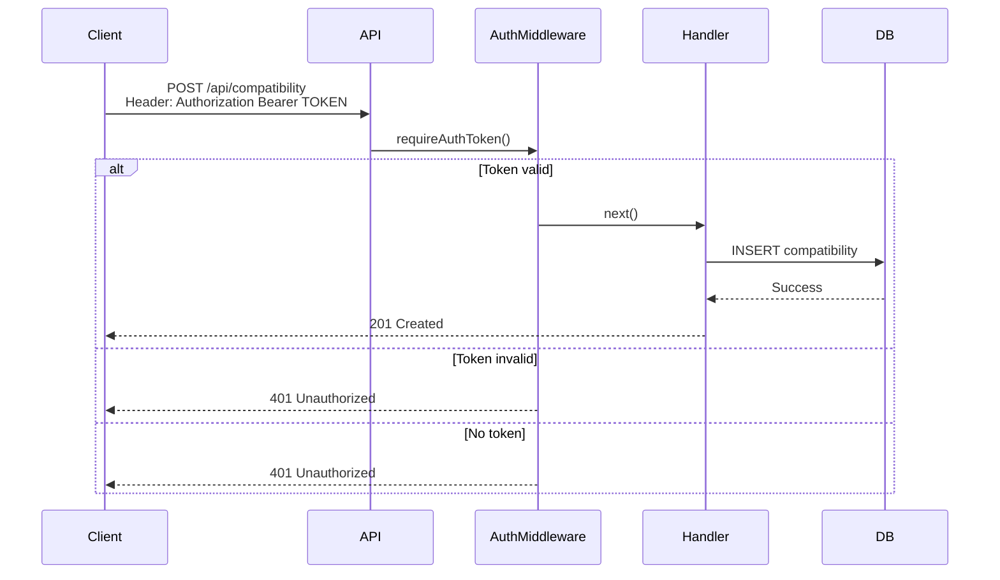

---

## 📦 Diagram Deploymentu

```mermaid
graph TB
    subgraph "Docker Compose"
        subgraph "nginx Container"
            A[Nginx<br/>Reverse Proxy]
        end
        
        subgraph "susmodder-api Container"
            B[Node.js API<br/>Port 3001]
        end
        
        subgraph "mysql Container"
            C[(MySQL 8.0<br/>Port 3306)]
        end
        
        subgraph "susadmin Container" 
            D[Admin Panel<br/>React App]
        end
    end
    
    Internet[Internet] -->|HTTPS| A
    
    A -->|/api/*| B
    A -->|/admin/*| D
    
    B -->|TCP 3306| C
    D -->|REST API| B
    
    C -.->|Volume Mount| E[/mysql/data]
    B -.->|Volume Mount| F[/nginx/html]
    
    style A fill:#4CAF50
    style B fill:#2196F3
    style C fill:#F44336
    style D fill:#FF9800
```

---

## 🔄 Diagram CI/CD (Przyszłość)

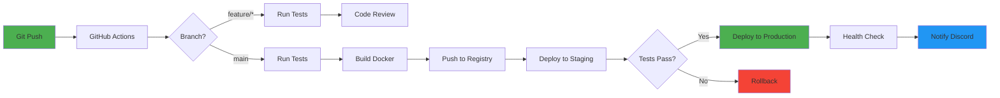

---

## 📊 Diagram Metryk i Monitoringu

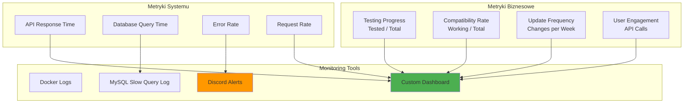

---

## 🎨 Diagram Kolorów UI

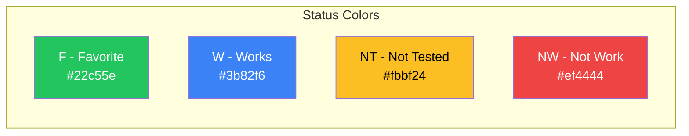

---

## 🗂️ Diagram Struktury Plików

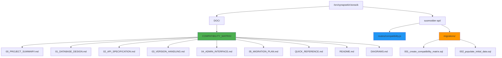

---

**Wszystkie diagramy można renderować w:**
- GitHub (natywnie wspiera Mermaid)
- VS Code (z rozszerzeniem Markdown Preview Mermaid)
- Mermaid Live Editor (https://mermaid.live)
- Dokumentacja online

**Ostatnia aktualizacja:** 2025-10-22
