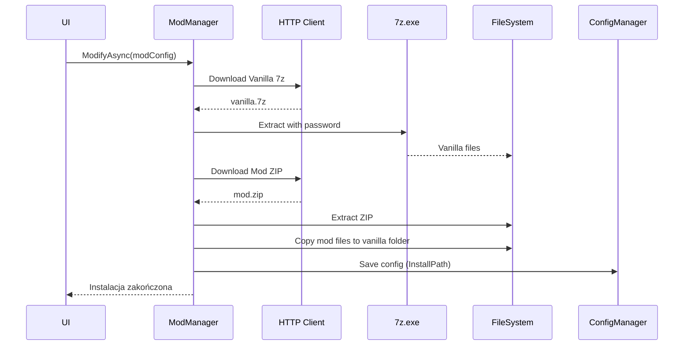

# SUSModder.Core - GameIntegration

## Przegląd
Moduł `GameIntegration` zawiera klasy odpowiedzialne za integrację z grą Among Us, lokalizację plików gry, instalację i aktualizację modów oraz zarządzanie wersjami dla platform Steam i Epic Games.

## Struktura plików

### ✅ **EpicVersionManager.cs** ✔️ [W UŻYCIU]
**Status:** Aktywnie używany  
**Opis:** Główny manager do zarządzania instalacją i aktualizacją modów dla wersji Epic Games przy użyciu narzędzia Legendary  
**Analiza użycia:** 6 użyć w MainWindowViewModel

**Lokalizacje użycia:**
- `MainWindowViewModel.cs:962` - inicjalizacja managera
- `MainWindowViewModel.cs:1438` - operacje Epic
- `MainWindowViewModel.cs:1631` - operacje Epic
- `MainWindowViewModel.cs:1947` - inicjalizacja managera
- `MainWindowViewModel.cs:2018` - operacje Epic

**Funkcjonalność:**
- Zarządza instalacją modów Epic Games przez narzędzie Legendary CLI
- Parsuje logi Legendary dla raportowania postępu
- Obsługuje manifesty gier Epic
- Wykrywa i naprawia błędy podczas instalacji (automatyczny retry)
- Weryfikuje zainstalowane aplikacje
- Zarządza logami instalacji (epic.log.txt, legendary.log.txt)
- Obsługuje błędy uruchamiania i pokazuje szczegółowe logi

**Interfejs `IEpicUserInteraction`:**
```csharp
interface IEpicUserInteraction
{
    bool Confirm(string message);
    void ShowError(string message);
}
```

**Wydarzenia:**
```csharp
event Action<string>? LegendaryOutput        // Output z Legendary CLI
event Action<int, string>? ProgressChanged   // Postęp instalacji (%, message)
event Action<ModConfiguration>? InstallationCompleted
event Action<string, string>? EpicLaunchError // (ModName, LogContent)
```

**Publiczne metody:**
```csharp
void ClearLegendaryLog()
string GetErrorLog()
Task<string?> CheckInstalledAppsAsync()
Task InstallOrUpdateModAsync(ModConfiguration modConfig, List<ModConfiguration> allConfigs)
Task LaunchModAsync(ModConfiguration modConfig)
```

**Kluczowe ścieżki:**
- `legendary.exe` - narzędzie CLI w katalogu aplikacji
- `{ModsInstallPath}/{ModName}` - katalog instalacji moda
- Manifest: `{ModsInstallPath}/{ModName}/.egstore/`

**Obsługa błędów:**
- Automatyczne retry przy błędach instalacji
- Wykrywanie uszkodzonych plików i ponowne pobieranie
- Szczegółowe logowanie do plików
- Parsowanie błędów Legendary

**Rekomendacja:** ✅ **ZACHOWAĆ** - Kluczowy dla obsługi wersji Epic Games.

---

### ✅ **GameLocator.cs** ✔️ [W UŻYCIU]
**Status:** Aktywnie używany  
**Opis:** Lokalizator gry Among Us dla platform Steam i Epic Games z auto-detekcją  
**Analiza użycia:** 1 użycie w MainWindowViewModel

**Lokalizacje użycia:**
- `MainWindowViewModel.cs:586` - auto-detekcja przy starcie aplikacji

**Funkcjonalność:**
- Auto-detekcja katalogu instalacji Among Us
- Rozpoznawanie platformy (Steam/Epic)
- Rejestracja wersji Vanilla w konfiguracji
- Dialog wyboru pliku .exe jeśli nie znaleziono automatycznie
- Odczyt wersji gry z pliku .exe

**Wspierane ścieżki:**

**Steam:**
```
%PROGRAMFILES(X86)%/Steam/steamapps/common/Among Us
%PROGRAMFILES%/Steam/steamapps/common/Among Us
%LOCALAPPDATA%/Steam/steamapps/common/Among Us
D:/Steam/steamapps/common/Among Us
D:/Gry/Steam/steamapps/common/Among Us
```

**Epic Games:**
```
%PROGRAMFILES(X86)%/Epic Games/AmongUs
%PROGRAMFILES%/Epic Games/AmongUs
D:/Epic Games/AmongUs
D:/Gry/Epic Games/AmongUs
```

**Publiczne metody:**
```csharp
static string? TryFindAmongUsPath(out string? mode)
static Task<bool> CheckAndSetupVanillaModAsync(
    List<ModConfiguration> modConfigs,
    IConfiguration configuration,
    IUserInteraction? userInteraction = null)
static void CheckAndSetupVanillaMod(...) // [DEPRECATED] - synchroniczna wersja
```

**Logika detekcji platformy:**
- **Epic:** Obecność folderu `.egstore` lub `Among Us_Data/StreamingAssets/aa/EGS`
- **Steam:** Brak znaczników Epic, struktura folderów Steam

**Zapisywana konfiguracja Vanilla:**
```csharp
{
    Id: 0,
    ModName: "AmongUs",
    ModType: "Vanilla",
    InstallPath: "{wykryta ścieżka}",
    AmongVersion: "{wersja z .exe}",
    Description: "Detected as {steam/epic}"
}
```

**Aktualizacja ustawień:**
- Zapisuje `Configuration:Mode` do appsettings.json
- Dodaje wpis Vanilla do config.json

**Rekomendacja:** ✅ **ZACHOWAĆ** - Kluczowy dla inicjalizacji aplikacji.

⚠️ **Refaktoring:** Rozważyć usunięcie synchronicznej metody `CheckAndSetupVanillaMod` (deprecated).

---

### ✅ **LegendaryProgressParser.cs** ✔️ [W UŻYCIU]
**Status:** Używany wewnętrznie przez EpicVersionManager  
**Opis:** Parser logów z narzędzia Legendary CLI do ekstrakcji informacji o postępie pobierania  
**Analiza użycia:** 0 bezpośrednich użyć (używany w EpicVersionManager)

**Funkcjonalność:**
- Parsuje logi Legendary CLI regex-ami
- Ekstrahuje informacje o postępie instalacji
- Identyfikuje fazy instalacji

**Klasa `LegendaryProgress`:**
```csharp
class LegendaryProgress
{
    double ProgressPercentage    // 0-100%
    int CurrentFiles             // Aktualna liczba pobranych plików
    int TotalFiles               // Całkowita liczba plików
    string? DownloadSize         // Rozmiar do pobrania (np. "1.2 GB")
    string? InstallSize          // Rozmiar instalacji
    string? ETA                  // Szacowany czas (format "HH:mm:ss")
    string? DownloadSpeed        // Prędkość (np. "5.2 MB/s")
    string Phase                 // Faza instalacji
}
```

**Parsowane wzorce (Regex):**
- `= Progress: (\d+\.?\d*)% \((\d+)/(\d+)\)` - postęp procentowy
- `Download size: ([\d.]+) (\w+)` - rozmiar pobierania
- `Install size: ([\d.]+) (\w+)` - rozmiar instalacji
- `ETA: (\d{2}:\d{2}:\d{2})` - szacowany czas
- `Download\s+-\s+([\d.]+) (\w+)/s` - prędkość

**Identyfikowane fazy:**
- "Przygotowywanie pobierania..." → `Preparing download`
- "Analizowanie manifestu gry..." → `Parsing game manifest`
- "Rozpoczynanie pobierania..." → `Starting download workers`
- "Pobieranie w toku..." → `= Progress:`
- "Finalizowanie instalacji..." → `Waiting for installation to finish`
- "Instalacja zakończona!" → `Finished installation process`
- "Uruchamianie gry..." → `Launching`

**Publiczne metody:**
```csharp
static LegendaryProgress? ParseProgress(string logLine)
static string GetPhase(string logLine)
```

**Rekomendacja:** ✅ **ZACHOWAĆ** - Istotne narzędzie dla EpicVersionManager.

---

### ✅ **ModDelete.cs** ✔️ [W UŻYCIU]
**Status:** Aktywnie używany  
**Opis:** Klasa odpowiedzialna za usuwanie zainstalowanych modów (full i DLL)  
**Analiza użycia:** 3 użycia

**Lokalizacje użycia:**
- `ModUpdate.cs:28` - usunięcie przed aktualizacją
- `ModUpdateChecker.cs:266` - usunięcie w procesie aktualizacji
- `ModService.cs:94` - bezpośrednie usuwanie moda

**Funkcjonalność:**
- Usuwanie modów typu "full" (całe foldery)
- Usuwanie modów typu "dll" (pliki .dll z folderów BepInEx)
- Aktualizacja konfiguracji po usunięciu
- Obsługa błędów (dostęp, brak plików)

**Publiczne metody:**
```csharp
static void DeleteMod(ModConfiguration modConfig, List<ModConfiguration> modConfigs, 
                     IUserInteraction userInteraction)
private static void DeleteFullMod(...)
private static void DeleteDllMod(...)
```

**Logika usuwania DLL:**
- Wyszukuje wszystkie mody "full" które mają `InstallPath`
- Usuwa plik `{ModName}.dll` z każdego z nich
- Ścieżka DLL: `{InstallPath}/{DllInstallPath}/{ModName}.dll`
- Domyślnie `DllInstallPath` = `BepInEx\plugins`

**Obsługa błędów:**
- Sprawdzenie istnienia katalogów/plików
- Try-catch z komunikatami użytkownikowi
- Aktualizacja `InstallPath` = `string.Empty` po usunięciu

**Rekomendacja:** ✅ **ZACHOWAĆ** - Podstawowa funkcjonalność zarządzania modami.

---

### ✅ **ModManager.cs** ✔️ [W UŻYCIU]
**Status:** Intensywnie używany  
**Opis:** Główny manager instalacji modów dla platformy Steam (dla Epic używa EpicVersionManager)  
**Analiza użycia:** 9 użyć

**Lokalizacje użycia:**
- `ModUpdate.cs:31` (2x) - aktualizacja modów
- `ModUpdateChecker.cs:280` - checker aktualizacji
- `ModService.cs:43, 56` - serwis modów
- `MainWindowViewModel.cs:969, 1709, 1954` - główny VM

**Funkcjonalność:**
- Instalacja modów typu "full" dla Steam
- Pobieranie vanilla 7z (zaszyfrowane hasłem)
- Rozpakowywanie archiwów 7z przez `tools/7z.exe`
- Pobieranie archiwów modów z GitHub
- Rozpakowywanie i kopiowanie plików moda
- Automatyczny retry przy błędach
- Szczegółowe raportowanie postępu

**Klasa `ModManagerUserCallbacks`:**
```csharp
class ModManagerUserCallbacks
{
    Func<string, string, Task<bool>>? ConfirmAsync
    Func<string, string, Task>? ShowErrorAsync
    Func<string, string, Task>? ShowInfoAsync
}
```

**Publiczne metody:**
```csharp
Task ModifyAsync(ModConfiguration modConfig, List<ModConfiguration> modConfigs,
                IProgressReporter progress, IDiagnosticsOutput log,
                ModManagerUserCallbacks userCallbacks, string mode)
```

**Proces instalacji Steam:**
1. **Przygotowanie (0-10%):** Utworzenie katalogów
2. **Pobieranie Vanilla (10-30%):** 
   - URL: `{BaseUrl}/api/susmodder-download-version?version={AmongVersion}`
   - Plik: `{ModsInstallPath}/Among Us - Vanilla/{version}.7z`
   - Autoryzacja: `SecretProvider.GetDownloadToken()`
3. **Pobieranie moda (30-50%):**
   - URL: `ModConfiguration.GitHubRepoOrLink`
   - Format: ZIP
4. **Rozpakowywanie Vanilla (50-60%):**
   - Użycie `tools/7z.exe` z hasłem (`SecretProvider.Get7zPassword()`)
   - Cel: `{ModsInstallPath}/{ModName}`
5. **Rozpakowywanie moda (60-80%):**
   - Ekstrakcja ZIP do temp
   - Detekcja głównego folderu (zawierającego BepInEx)
6. **Kopiowanie plików (80-90%):**
   - Kopiowanie zawartości moda do folderu gry
7. **Finalizacja (90-100%):**
   - Zapis konfiguracji (`InstallPath`, `LastUpdated`)
   - Cleanup temp

**Obsługa błędów i retry:**
- Uszkodzone pliki vanilla → usuń i pobierz ponownie
- Błędy pobierania → pytanie o retry
- Brak uprawnień → szczegółowa informacja z instrukcjami
- Błędy rozpakowywania → pytanie o ponowne pobranie

**Metody pomocnicze:**
```csharp
Task<bool> DownloadFileWithMemoryManagementAsync(...)
void Extract7zWithPassword(string archivePath, string outputPath, string password)
void CopyContent(string sourceDir, string targetDir)
Task SafeDeleteDirectory(string path)
```

**Zależności:**
- `IConfiguration` - URL API, BaseUrl
- `IDiagnosticsOutput` - logowanie
- `IProgressReporter` - raportowanie postępu (0-100%)
- `SecretProvider` - token HTTP i hasło 7z
- `PathSettings.ModsInstallPath` - katalog instalacji

**Rekomendacja:** ✅ **ZACHOWAĆ** - Kluczowy element systemu instalacji.

---

### ✅ **ModUpdate.cs** ✔️ [W UŻYCIU]
**Status:** Aktywnie używany  
**Opis:** Klasa orkiestrująca proces aktualizacji pojedynczego moda  
**Analiza użycia:** 1 użycie w ModService

**Lokalizacje użycia:**
- `ModService.cs:83` - wywoływanie aktualizacji moda

**Funkcjonalność:**
- Koordynuje proces aktualizacji moda
- Usuwa starą wersję (`ModDelete`)
- Instaluje nową wersję (`ModManager`)
- Wspiera tryby Steam i Epic

**Publiczne metody:**
```csharp
static Task UpdateModAsync(ModConfiguration modConfig, List<ModConfiguration> modConfigs,
                          IProgressReporter progress, IDiagnosticsOutput log,
                          IUserInteraction userInteraction, IConfiguration configuration)
```

**Proces aktualizacji:**
1. Sprawdzenie typu moda ("full" tylko)
2. Usunięcie istniejącej wersji przez `ModDelete.DeleteMod`
3. Ponowna instalacja przez `ModManager.ModifyAsync`
4. Raportowanie postępu
5. Komunikat sukcesu

**Pobiera mode z konfiguracji:**
```csharp
string mode = configuration["Configuration:Mode"] ?? "steam";
```

**Obsługa błędów:**
- Try-catch z logowaniem
- Komunikaty do użytkownika przez `IUserInteraction`

**Rekomendacja:** ✅ **ZACHOWAĆ** - Prosty ale ważny orchestrator.

---

### ✅ **ModUpdateChecker.cs** ✔️ [W UŻYCIU]
**Status:** Aktywnie używany  
**Opis:** System sprawdzania dostępności aktualizacji modów i zarządzania procesem update  
**Analiza użycia:** 1 użycie w UpdateDialog

**Lokalizacje użycia:**
- `UpdateDialog.axaml.cs:242` - aktualizacja wybranych modów

**Funkcjonalność:**
- Sprawdza dostępne aktualizacje modów
- Porównuje wersje lokalne vs serwer
- Pozwala wybrać mody do aktualizacji
- Wykonuje aktualizację wybranych modów
- Obsługuje aktualizacje sekwencyjne

**Klasa `ModUpdateInfo`:**
```csharp
class ModUpdateInfo : INotifyPropertyChanged
{
    ModConfiguration? LocalMod      // Lokalna konfiguracja
    ModConfiguration? RemoteMod     // Serwer konfiguracja
    bool IsSelected                 // Czy zaznaczony do aktualizacji
    string ChangeDescription        // Opis zmian (ModVersion, AmongVersion)
}
```

**Publiczne metody:**
```csharp
static Task CheckForModUpdatesAsync(IConfiguration configuration, IDiagnosticsOutput log,
                                   IUserInteraction userInteraction, 
                                   IProgressReporter? progress = null)

static Task<List<ModUpdateInfo>> GetAvailableUpdatesAsync(IConfiguration configuration,
                                                          IDiagnosticsOutput log)

static Task UpdateSelectedModsAsync(List<ModUpdateInfo> selectedMods, 
                                   IConfiguration configuration, IDiagnosticsOutput log,
                                   IUserInteraction userInteraction, 
                                   IProgressReporter? progress = null)
```

**Logika sprawdzania aktualizacji:**
1. Pobierz konfigurację z API (`Configuration:UpdateServerUrl`)
2. Załaduj lokalną konfigurację (`ConfigManager.LoadConfig()`)
3. Porównaj wersje:
   - Zainstalowany mod (InstallPath != null)
   - Różne wersje (ModVersion lub AmongVersion)
4. Zwróć listę `ModUpdateInfo`

**Proces aktualizacji:**
- Sekwencyjna aktualizacja każdego moda z listy
- Raportowanie postępu dla każdego
- Obsługa błędów per mod (nie przerywa całego procesu)

**Metody prywatne:**
```csharp
Task<List<ModConfiguration>?> DownloadRemoteConfigAsync(...)
List<ModUpdateInfo> FindModsWithUpdates(...)
void ProposeUpdatesToUser(...)  // Tylko interfejs, bez UI
Task UpdateSingleMod(...)
```

**Endpoint API:**
- URL: `Configuration:UpdateServerUrl`
- Autoryzacja: `SecretProvider.GetDownloadToken()`
- Format: JSON lista `ModConfiguration[]`

**Rekomendacja:** ✅ **ZACHOWAĆ** - Kluczowy dla systemu aktualizacji.

---

## Podsumowanie analizy

### ✅ Wszystkie klasy w użyciu:
1. **EpicVersionManager.cs** - zarządzanie instalacją Epic Games
2. **GameLocator.cs** - lokalizacja i detekcja gry
3. **LegendaryProgressParser.cs** - parser logów Legendary
4. **ModDelete.cs** - usuwanie modów
5. **ModManager.cs** - instalacja modów Steam
6. **ModUpdate.cs** - orkiestrator aktualizacji
7. **ModUpdateChecker.cs** - sprawdzanie i zarządzanie aktualizacjami

### Statystyki:
- **Pliki ogółem:** 7
- **Aktywne:** 7 (100%)
- **Do usunięcia:** 0 (0%)

---

## Architektura i przepływ danych

```
GameIntegration/
│
├─ Detekcja i lokalizacja
│  └─ GameLocator
│     ├─ Auto-detekcja Steam/Epic
│     ├─ Rejestracja Vanilla
│     └─ Aktualizacja Configuration:Mode
│
├─ Instalacja modów
│  ├─ Steam: ModManager
│  │  ├─ Pobieranie Vanilla 7z (SecretProvider)
│  │  ├─ Rozpakowywanie 7z (tools/7z.exe)
│  │  ├─ Pobieranie moda ZIP
│  │  └─ Kopiowanie plików
│  │
│  └─ Epic: EpicVersionManager
│     ├─ Legendary CLI wrapper
│     ├─ Parsowanie logów (LegendaryProgressParser)
│     ├─ Zarządzanie manifestami
│     └─ Retry logic
│
├─ Aktualizacje
│  ├─ ModUpdateChecker
│  │  ├─ Pobieranie config z API
│  │  ├─ Porównywanie wersji
│  │  └─ Lista ModUpdateInfo
│  │
│  └─ ModUpdate (orchestrator)
│     ├─ ModDelete (usunięcie starej wersji)
│     └─ ModManager/EpicVersionManager (instalacja nowej)
│
└─ Usuwanie
   └─ ModDelete
      ├─ Full mods (całe foldery)
      └─ DLL mods (pliki .dll z BepInEx)
```

### Zależności zewnętrzne:
- `Microsoft.Extensions.Configuration` - dostęp do appsettings.json
- `System.Net.Http` - pobieranie plików
- `System.IO.Compression` - rozpakowywanie ZIP
- `System.Diagnostics` - uruchamianie procesów (7z.exe, legendary.exe)
- `SUSModder.Core.Configuration` - ConfigManager, ModConfiguration
- `SUSModder.Core.Utilities` - PathSettings, IUserInteraction, IProgressReporter
- `SUSModder.Core.Diagnostics` - IDiagnosticsOutput
- `SecretProvider` - tokeny i hasła

### Narzędzia zewnętrzne:
- `tools/7z.exe` - rozpakowywanie zaszyfrowanych archiwów vanilla
- `legendary.exe` - CLI Epic Games Store dla instalacji modów Epic

---

## Kluczowe ścieżki i katalogi

```
{ModsInstallPath}/
├─ Among Us - Vanilla/          # Archiwum vanilla dla różnych wersji
│  ├─ 2024111.7z
│  ├─ 2024322.7z
│  └─ ...
├─ {ModName}/                   # Instalacje modów full
│  ├─ Among Us.exe
│  ├─ BepInEx/
│  │  └─ plugins/
│  │     └─ {DllMods}.dll
│  └─ ...
├─ Konfiguracje/                # Presety gry (ModConfigHandler)
│  └─ *.zip
└─ temp/                        # Tymczasowe rozpakowania
```

---

## Sekwencja instalacji moda (Steam)



---

## Następne kroki refaktoringu

1. ⚠️ **GameLocator:** Usunąć przestarzałą synchroniczną metodę `CheckAndSetupVanillaMod` (użyj async wersji)
2. ⚠️ **Interfejsy:** Rozważyć wydzielenie interfejsów:
   - `IGameLocator`
   - `IModInstaller` (implementacje: SteamModManager, EpicModManager)
   - `IModUpdateService`
3. ⚠️ **Testowanie:** Dodać unit testy dla `LegendaryProgressParser` (deterministyczne parsowanie regex)
4. ✅ **Dokumentacja:** Dodać przykłady użycia do XML comments

---

*Dokumentacja wygenerowana: 2025-10-19*  
*Autor: GitHub Copilot AI Assistant*
