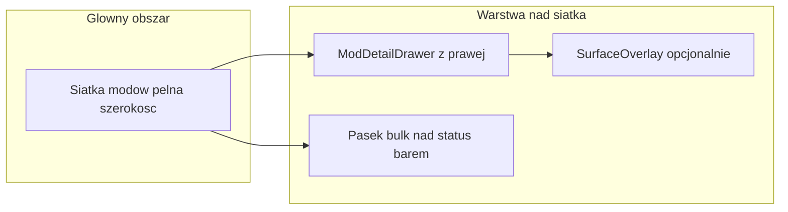
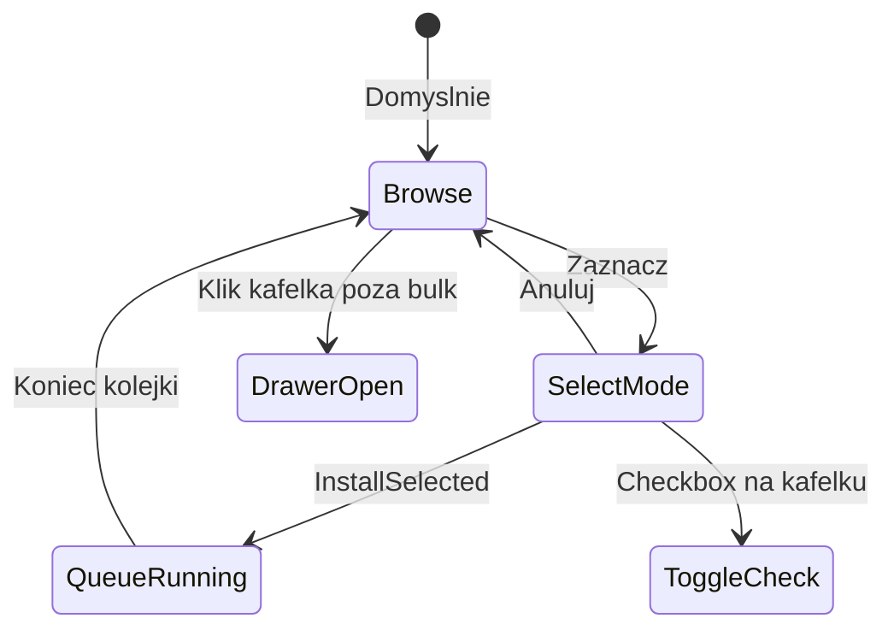

# POC: Odświeżenie UI SUSModder 3.0

**Data:** 2026-06-01  
**Status:** Analiza / POC (wdrożenie fazowe na branchu `susmodder-3.0`)  
**Priorytet:** P1 (tożsamość wizualna 3.0 + fundament pod bulk)  
**Powiązane:** [`18-beanmodmanager-ideas.md`](../2026-05-25%20-%20frontend-ideas/18-beanmodmanager-ideas.md), [`06-microinteractions-polish.md`](../2026-05-25%20-%20frontend-ideas/06-microinteractions-polish.md)

---

## Kontekst i cele

SUSModder 2.x ma sprawdzony układ: siatka kafelków + stały panel 350px po prawej. Działa, ale:

- panel zajmuje ~40% szerokości nawet gdy użytkownik tylko przegląda listę,
- status moda (zainstalowany / aktualizacja / instalacja) jest głównie w tooltipie,
- nadchodzą **operacje masowe** (#18) — obecny UI nie rozróżnia „wybrany mod do podglądu” od „zaznaczony do bulk”.

**Cel 3.0:** wyraźna zmiana pierwszego wrażenia przy zachowaniu prostoty i czytelności (zgodnie z README: „prosty, szybki, bez kombinowania”).

**Decyzja layoutu (2026-06-01):** wariant **bold** — pełnoszeroka siatka + panel jako drawer; bulk w tym samym gridzie, osobny tryb „Zaznacz”.

---

## Stan obecny (2.x)

| Element | Plik | Opis |
|---------|------|------|
| Siatka modów | `SUSModder/Views/MainWindow.axaml` | `ListBox` + `FlexPanel`, karta 140×140 |
| Style kart | `SUSModder/Styles/ModCardStyle.axaml` | Hover scale 1.03; selekcja = obwódka 3px + glow `#80FF6B6B` |
| Panel moda | `MainWindow.axaml` | Stała kolumna 350px, header w pełnym `AccentBrush` |
| Motyw ciemny | `SUSModder/Themes/DarkTheme.axaml` | `#1A1D2B` / `#2D3748` / akcent `#4299E1` |
| Model | `SUSModder/ViewModels/ModItem.cs` | Progress instalacji tylko w panelu |
| Mikrointerakcje | #06 ✅ | Skeleton, tooltipy, hover — zostają, dostosować do `ModCard` |

Baseline screenshotów: `DOC/readme/screenshot-main.png`, `screenshot-install.png`, `screenshot-launch.png`.

---

## Kierunek layoutu: siatka + drawer



### Zachowanie

1. **Start:** siatka na pełnej szerokości (brak stałej kolumny 350px).
2. **Klik kafelka:** `ModDetailDrawer` wjeżdża z prawej (~400px, `MaxWidth` ~45% okna).
3. **Scrim:** `SurfaceOverlayBrush` 45% — klik poza drawer zamyka panel (`CloseModDetailCommand`).
4. **Double-click:** bez zmiany semantyki (istniejący `ModDoubleClickCommand`).
5. **MinWidth 890:** drawer nie zasłania całej siatki; min. ~2 kolumny kafelków widoczne.

### Wireframe — okno główne

```
┌──────────────────────────────────────────────────────────────┐
│  [Zaznacz]  Zaznaczono: 0          (ModGridToolbar)          │
├──────────────────────────────────────────────────────────────┤
│  ┌────┐ ┌────┐ ┌────┐ ┌────┐ ┌────┐ ┌────┐                   │
│  │mod │ │mod │ │mod │ │mod │ │mod │ │mod │   siatka        │
│  └────┘ └────┘ └────┘ └────┘ └────┘ └────┘                   │
│                                    ┌─────────────────────┐ │
│                                    │ [X]  Panel drawer   │ │
│                                    │  ... szczegóły ...  │ │
│                                    └─────────────────────┘ │
├──────────────────────────────────────────────────────────────┤
│  [Zainstaluj (0)] [Aktualizuj] [Odinstaluj]  (bulk bar)    │
├──────────────────────────────────────────────────────────────┤
│  Status bar (bez zmian w tym POC)                            │
└──────────────────────────────────────────────────────────────┘
```

---

## Kafelki modów (v3)

| Aspekt | 2.x | 3.0 |
|--------|-----|-----|
| Rozmiar | 140×140 | **152×168** |
| Tło | `ModCardBackgroundBrush` | `SurfaceElevatedBrush` (+ alias na stary klucz) |
| Status | tooltip | **Badge** 8px: zielony / szary / pomarańczowy / niebieski |
| Zainstalowany | opacity ikony | opacity + opcjonalny pierścień 1px `AccentMutedBrush` |
| Nawigacja (selected) | gruba obwódka + różowy glow | **lewa krawędź 3px** `SelectionBarBrush` |
| Bulk | — | checkbox w rogu, tylko gdy `IsBulkSelectionMode` |
| Instalacja | panel | **pasek 3px** u dołu kafelka (`IsInstalling`) |

### Wireframe kafelka

```
┌──────────────────┐
│ ○ badge    [☐]   │  ← bulk checkbox tylko w trybie Zaznacz
│                  │
│     [ ikona ]    │
│                  │
│   Nazwa moda     │
│▓▓▓░░░░░░░░░░░░░│  ← progress (opcjonalnie)
└──────────────────┘
█ ← selection bar (3px lewa)
```

### Komponent

- `SUSModder/Controls/ModCard.axaml` — `UserControl`, `x:DataType="ModItem"`
- Style: `ModCardStyle.axaml` — klasy `mod-card`, `mod-card--bulk-checked`

### Nowe właściwości VM

| Właściwość | Poziom | Opis |
|------------|--------|------|
| `IsCheckedForBulk` | `ModItem` | Zaznaczenie do operacji masowej |
| `HasUpdateAvailable` | `ModItem` | Badge aktualizacji (ustawiane z `MainWindowViewModel` przy odświeżeniu listy) |
| `IsBulkSelectionMode` | `MainWindowViewModel` | Tryb checkboxów |
| `BulkSelectedCount` | `MainWindowViewModel` | Licznik do toolbara i paska akcji |

---

## Panel moda: ModDetailDrawer

Wyciągnięty z `MainWindow.axaml` do `SUSModder/Views/ModDetailDrawer.axaml`.

### Struktura

```
┌─ Drawer (400px) ─────────────┐
│ ████ 4px AccentPrimary       │  ← pasek akcentu u góry (nie cały header)
│ [X]  Ikona   Nazwa            │
│      wersja moda / AU         │
├──────────────────────────────┤
│ Opis (scroll)                 │
│ Progress box                  │
│ Przyciski kontekstowe         │
├──────────────────────────────┤
│ STICKY: Primary CTA           │
│         Secondary / flyout    │
└──────────────────────────────┘
```

### Hierarchia CTA

- **Jeden primary:** Instaluj / Uruchom (zielony / akcent).
- **Reszta:** istniejące przyciski zachowane; w kolejnych iteracjach można zwijać do `MenuFlyout` „Więcej akcji”.
- Header: `SurfaceCardBrush` zamiast pełnego `AccentBrush` na całym bloku.

Animacja: rozszerzenie `PanelStyles.axaml` — `drawer-panel`, `drawer-enter`.

---

## Bulk install — integracja UI (#18)

Bulk = ten sam grid, drugi tryb (nie osobny ekran).



| Element | Zachowanie |
|---------|------------|
| `ModGridToolbar` | Przycisk „Zaznacz” / „Anuluj”, licznik |
| Kafelki | `bulk-checked` — odcień `#8B5CF6` (nie mylić z selection bar) |
| `BulkActionBar` | Sticky nad status barem: Instaluj / Aktualizuj / Odinstaluj (N) |
| Kolejka | `ModInstallQueue` w Core — sekwencyjnie, błąd jednego nie przerywa reszty |
| Banner | `BulkQueueBanner` — „3/5 modów” podczas kolejki |
| Wykluczenia | Vanilla (Id=0), typ `dll` poza bulk install full |

### Core (faza 4)

`SUSModder.Core/Services/ModInstallQueue.cs`:

- `EnqueueAsync(IEnumerable<ModQueueItem>)`
- Progress: `CurrentIndex`, `Total`, `CurrentModName`
- Callback per-item success/fail

Podpięcie w `MainWindowViewModel.BulkOperations.cs` (partial).

---

## Motyw Dark 3.0

Nowe tokeny semantyczne w `DarkTheme.axaml` — **stare klucze jako aliasy** (brak masowej migracji dialogów).

| Token | Wartość | Rola |
|-------|---------|------|
| `SurfaceBaseColor` | `#12141C` | Tło okna (alias `WindowBackground`, `PrimaryBackground`) |
| `SurfaceElevatedColor` | `#1E2433` | Kafelki (alias `ModCardBackground`) |
| `SurfaceCardColor` | `#252B3D` | Drawer header |
| `SurfaceOverlayColor` | `#73000000` | Scrim (~45%) |
| `AccentPrimaryColor` | `#3B9EFF` | CTA (alias `Accent`) |
| `AccentMutedColor` | `#2A4A6B` | Hover obramowań |
| `StatusInstalledColor` | `#34D399` | Badge |
| `StatusUpdateColor` | `#FBBF24` | Badge aktualizacji |
| `StatusBusyColor` | `#60A5FA` | Instalacja |
| `SelectionBarColor` | `#3B9EFF` | Lewa krawędź selected |
| `BulkSelectionColor` | `#8B5CF6` | Obramowanie bulk |

Gradient okna (dark only): `WindowBackgroundGradient` — opcjonalny `LinearGradientBrush` w `App.axaml` / `MainWindow` tło — faza 5.

Pink / Light: mapowanie tokenów w osobnej fazie (non-goal pierwszego release UI 3.0).

---

## Architektura plików

| Akcja | Plik |
|-------|------|
| Nowy | `DOC/POC/2026-06-01-ui-refresh-v3-poc.md` |
| Nowy | `SUSModder/Controls/ModCard.axaml` (+ `.cs`) |
| Nowy | `SUSModder/Views/ModDetailDrawer.axaml` (+ `.cs`) |
| Nowy | `SUSModder/Views/ModGridToolbar.axaml` (+ `.cs`) |
| Nowy | `SUSModder/Views/BulkActionBar.axaml` (+ `.cs`) |
| Nowy | `SUSModder/ViewModels/MainWindowViewModel.BulkOperations.cs` |
| Nowy | `SUSModder.Core/Services/ModInstallQueue.cs` |
| Modyfikacja | `SUSModder/Themes/DarkTheme.axaml` |
| Modyfikacja | `SUSModder/Styles/ModCardStyle.axaml` |
| Modyfikacja | `SUSModder/Styles/PanelStyles.axaml` |
| Modyfikacja | `SUSModder/Views/MainWindow.axaml` |
| Modyfikacja | `SUSModder/ViewModels/ModItem.cs` |
| Modyfikacja | `SUSModder/pl.json`, `en.json` — klucze bulk UI |

---

## Fazy i estymacje

| Faza | Zakres | Effort | Status POC |
|------|--------|--------|------------|
| 0 | Ten dokument | 0.5 d | ✅ |
| 1 | Tokeny + ModCard + style | 2–3 d | 🔧 implementacja |
| 2 | ModDetailDrawer + MainWindow layout | 3–4 d | 🔧 implementacja |
| 3 | Toolbar + bulk UI (VM) | 1–2 d | 🔧 implementacja |
| 4 | ModInstallQueue + banner | 4–6 d | 🔧 implementacja |
| 5 | Screenshoty README + pink/light | 1 d | ⏳ przed release |

**Release:** fazy 1–2 → **3.0.0**; bulk 3–4 → **3.0.x** lub jeden release jeśli timeline pozwala.

---

## Ryzyka

| Ryzyko | Mitigacja |
|--------|-----------|
| Konflikt klik: drawer vs bulk checkbox | W `IsBulkSelectionMode` klik kafelka toggluje checkbox; poza trybem — selection + drawer |
| `Mods.Clear()` resetuje bulk | Przy refresh zachować `HashSet<int>` zaznaczonych Id |
| Wydajność cieni/gradientu | Profilować; fallback flat brush |
| Pink + gradient + serca | Osobna faza; test kontrastu badge |
| Drawer a11y | ESC zamyka drawer; focus trap — backlog |

---

## Decyzje do podjęcia przed release

1. Czy klik w scrim **zawsze** zamyka drawer, czy zostawia otwarty podczas instalacji? → POC: zamyka, chyba że `IsInstalling` na wybranym modzie.
2. Czy „Więcej akcji” w jednym flyout w 3.0.0 czy dopiero 3.0.1? → POC: zachować wszystkie przyciski w drawer (bez regresji).
3. Bulk „Aktualizuj zaznaczone” — tylko mody z `HasUpdateAvailable`? → tak.

---

## Non-goals

- Przebudowa status bara, FAB, ustawień.
- Wyszukiwarka / filtr modów.
- Light/pink jako pierwszy target wizualny.
- Gęstość informacji jak WinForms BMM.
- Import modów lokalnych (osobny scope #18-C).

---

## Kryteria akceptacji

1. Przy starcie widać **pełnoszeroką siatkę** (bez stałej kolumny 350px).
2. Panel moda = **drawer** ze scrimem.
3. Status moda widoczny na kafelku **bez tooltipa** (badge + opcjonalny progress bar).
4. Tryb bulk: checkboxy **tylko** po „Zaznacz”; wizualnie odróżnione od selection bar.
5. Motyw dark: nowe tokeny; dialogi ze starymi kluczami działają (aliasy).
6. Przed release 3.0: nowe `DOC/readme/screenshot-*.png`.

---

## Powiązane dokumenty

- [`18-beanmodmanager-ideas.md`](../2026-05-25%20-%20frontend-ideas/18-beanmodmanager-ideas.md) — bulk Core, ZIP validation, import
- [`06-microinteractions-polish.md`](../2026-05-25%20-%20frontend-ideas/06-microinteractions-polish.md) — hover, skeleton, tooltipy
- [`2026-05-27-lobby-code-sharing.md`](2026-05-27-lobby-code-sharing.md) — wzorzec formatu POC
