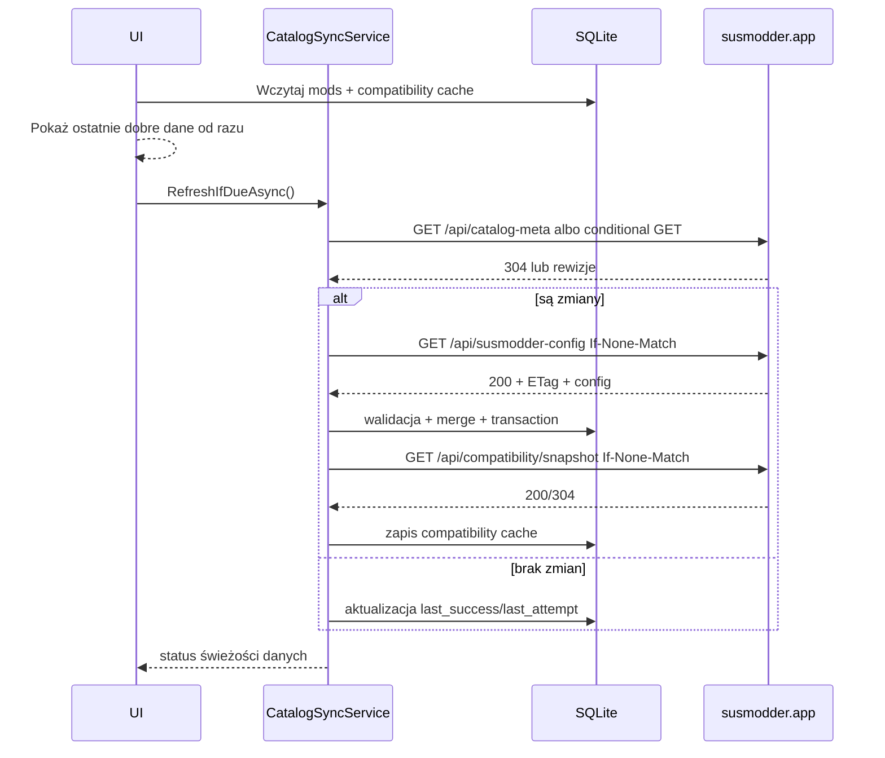

# POC: Niezawodniejsza synchronizacja configu i tabeli kompatybilności

**Data:** 2026-06-04  
**Status:** Analiza / POC do akceptacji przed implementacją  
**Priorytet:** P1  
**Zakres:** SUSModder desktop, SUSModder.Core, backend `susmodder.app` / `susmodder-api`  
**Źródła:** lokalny kod SUSModder, `mcp-rag` dla repo i backendu, Microsoft Learn dla conditional GET/ETag oraz zaleceń `HttpClient`

---

## 1. Cel

Ulepszyć mechanizm pobierania katalogu modów (`/api/susmodder-config`) i danych kompatybilności (`/api/compatibility`) tak, aby był:

- **bardziej niezawodny**: działał sensownie offline, przy timeoutach i częściowych awariach API,
- **dokładniejszy**: status kompatybilności odpowiadał wersjom faktycznie wybranym/zainstalowanym, a nie przypadkowo najnowszym,
- **oszczędny dla API**: mniej pełnych odpowiedzi JSON, brak podwójnych requestów, współdzielony cache i conditional requests,
- **kompatybilny wstecz**: obecne endpointy i formaty odpowiedzi nie mogą zostać złamane.

Wniosek: mechanizm da się ulepszyć bez rewolucji. Największą wartość daje centralizacja pobierania w Core + ETag/304 po stronie API + trwały cache kompatybilności w SQLite.

---

## 2. Obecny stan

### 2.1 Config modów

Źródłem jest `Configuration:UpdateServerUrl` w `SUSModder/appsettings.json`:

```json
"UpdateServerUrl": "https://susmodder.app/api/susmodder-config"
```

Desktop ma kilka równoległych ścieżek pobierania:

| Miejsce | Zachowanie |
|---|---|
| `SUSModder.Core/Data/ModRepository.cs` | SQLite path. Przy pustej tabeli lub ręcznym refreshu pobiera cały JSON z API, merguje dane instalacji, zapisuje całą tabelę `mods`. Timeout 15 s. |
| `SUSModder.Core/Configuration/ModConfig.cs` | Fallback JSON path. Pobiera cały JSON, czasem dodaje `Authorization`, zapisuje lokalnie. |
| `SUSModder.Core/Repositories/ConfigRepository.cs` | Legacy repo używane nadal przez część update checkerów. Pobiera cały JSON, bez współdzielonego cache. |
| `SUSModder/ViewModels/MainWindowViewModel.StatusBar.cs` | Co 30 s robi GET do `UpdateServerUrl` jako ping API; co 15 min po udanym ping robi drugi GET przez `RefreshConfigFromApiAsync()`. |
| `ModUpdateManager` / `DllUpdateManager` / `ConfigService.CheckSingleModUpdateAsync()` | Dodatkowe bezpośrednie pobrania configu z API przy sprawdzaniu aktualizacji. |

Backend `susmodder-api/routes/config.js`:

- `GET /susmodder-config` zwraca legacy JSON array.
- Cache backendowy ma TTL 60 s.
- Odpowiedź ma `X-Cache`, ale brak `ETag`, `Last-Modified`, `304 Not Modified` i lekkiego metadanych-only endpointu.
- Endpoint śledzi online usera i odpytuje DB przy cache miss.

### 2.2 Tabela kompatybilności

Desktop:

- `SUSModder.Core/Services/CompatibilityService.cs` odpytuje `GET /api/compatibility?dllModId=...` albo `?fullModId=...`.
- Wyniki trzyma tylko w statycznym `MemoryCache` przez 10 minut.
- Brak trwałego cache w SQLite, więc po restarcie albo awarii API dane F/W/NW znikają.
- Client nie przekazuje `fullModVersion` ani `dllModVersion`, mimo że backend je obsługuje.
- Cache key po stronie klienta bazuje na ID, nie na wersjach.
- Przy błędzie API serwis zwraca pustą macierz. W UI oznacza to głównie „nieznane”, co może odsłonić DLL znane wcześniej jako `NW`.

Backend `susmodder-api/routes/compatibility.js`:

- `GET /compatibility` wybiera tryb po `fullModId` albo `dllModId`.
- Jeśli wersja nie jest podana, używa bieżącej wersji moda z tabeli `config`.
- Dla query po FULL sprawdza konkretną `FullModVersion`, a `IsCurrentVersion` dotyczy wersji DLL w zwróconym wierszu.
- Dla query po DLL analogicznie sprawdza konkretną `DllModVersion`, a `IsCurrentVersion` dotyczy wersji FULL.
- Cache backendowy ma TTL 120 s.
- Brak ETag/304 i brak publicznego snapshotu całej aktualnej macierzy bez autoryzacji.

---

## 3. Najważniejsze problemy

### P1. Zbyt dużo pełnych requestów do configu

Status bar robi GET pełnego configu co 30 s tylko po to, żeby określić online/offline. Co 15 min może zrobić drugi pełny GET zaraz po pierwszym. Osobno update checkery potrafią pobrać config jeszcze raz.

Efekt:

- niepotrzebny transfer JSON,
- więcej requestów do API,
- trudniej kontrolować rate limiting,
- niespójne wyniki, bo różne klasy mają osobne timeouty i osobną obsługę błędów.

### P2. Brak conditional GET

Klient nie wysyła `If-None-Match`, a backend nie zwraca `ETag`. Nawet jeśli config się nie zmienił, pełna odpowiedź jest pobierana i deserializowana.

HTTP rozwiązuje ten przypadek standardowo: serwer zwraca `ETag`, klient przy kolejnym GET wysyła `If-None-Match`, a przy braku zmian dostaje `304 Not Modified` bez body.

### P3. Nie ma trwałego cache kompatybilności

Dane kompatybilności wpływają na bezpieczeństwo instalacji DLL. Jeśli API chwilowo nie działa, aplikacja traci wiedzę o `NW` i może pokazać mod jako „nieznany” zamiast „nie działa”.

### P4. Kompatybilność nie jest liczona dla faktycznych wersji

Endpoint potrafi przyjąć `fullModVersion` i `dllModVersion`, ale klient ich nie wysyła. Dla zainstalowanego starszego FULL moda zapytanie domyślnie może dotyczyć najnowszej wersji z backendu, nie wersji w folderze użytkownika.

### P5. Brak jednej warstwy synchronizacji

`ModRepository`, `ConfigManager`, `ConfigRepository`, `CompatibilityService`, `ModUpdateManager` i status bar robią podobne rzeczy różnymi ścieżkami. To utrudnia backoff, deduplikację requestów, metryki i testy.

### P6. Pusty/niepoprawny response jest traktowany zbyt podobnie do „brak zmian”

W kilku miejscach błąd pobrania kończy się pustą listą albo `false`. Dla UI to często tylko brak aktualizacji, a nie informacja „API niedostępne, użyto cache”.

---

## 4. Proponowana architektura

### 4.1 Jeden serwis synchronizacji katalogu w Core

Nowy komponent w `SUSModder.Core`, roboczo:

```text
Services/CatalogSyncService.cs
Data/ICatalogSyncStateRepository.cs
Data/CatalogSyncStateRepository.cs
Data/ICompatibilityCacheRepository.cs
Data/CompatibilityCacheRepository.cs
```

Odpowiedzialność `CatalogSyncService`:

1. Pobiera config i kompatybilność wyłącznie przez jedną ścieżkę.
2. Obsługuje `ETag`, `If-None-Match`, `304`, timeouty, retry/backoff i jitter.
3. Waliduje odpowiedź przed zapisem do SQLite.
4. Robi atomiczny merge z lokalnymi polami instalacji.
5. Udostępnia wyniki obecnym serwisom (`ConfigService`, update checkery, UI) bez bezpośredniego `ConfigRepository.LoadConfigFromApiAsync()`.

Nie trzeba od razu usuwać legacy klas, ale nowe wywołania powinny iść przez ten serwis.

### 4.2 Stan synchronizacji w SQLite

Nowa tabela, przykładowo `sync_state`:

```sql
CREATE TABLE sync_state (
  key TEXT PRIMARY KEY,
  etag TEXT NULL,
  last_modified TEXT NULL,
  last_success_utc TEXT NULL,
  last_attempt_utc TEXT NULL,
  last_error_code TEXT NULL,
  failure_count INTEGER NOT NULL DEFAULT 0,
  next_allowed_attempt_utc TEXT NULL
);
```

Klucze:

- `catalog.config`
- `compatibility.snapshot`
- opcjonalnie `compatibility.full.{fullModId}.{fullVersion}` albo `compatibility.dll.{dllModId}.{dllVersion}` jeśli zostajemy przy per-mod requestach.

Nowa tabela cache kompatybilności:

```sql
CREATE TABLE compatibility_cache (
  full_mod_id INTEGER NOT NULL,
  full_mod_version TEXT NOT NULL,
  dll_mod_id INTEGER NOT NULL,
  dll_mod_version TEXT NOT NULL,
  status TEXT NOT NULL CHECK(status IN ('F','W','NT','NW')),
  is_exact_version INTEGER NOT NULL DEFAULT 1,
  warning TEXT NULL,
  source_updated_at TEXT NULL,
  fetched_at_utc TEXT NOT NULL,
  PRIMARY KEY (full_mod_id, full_mod_version, dll_mod_id, dll_mod_version)
);
```

### 4.3 Backend: additive HTTP cache headers

Zachować `GET /api/susmodder-config` jako JSON array, ale dodać nagłówki:

- `ETag: "config-{revision}"`
- `Last-Modified: ...`
- `Cache-Control: public, max-age=60, stale-while-revalidate=300`
- obsługa `If-None-Match` -> `304 Not Modified`

`revision` może być wyliczany z:

- `MAX(UpdatedAt)` / `MAX(LastUpdated)` w tabeli `config`, albo
- prostego monotonicznego rekordu `catalog_revision`, inkrementowanego po zmianie admina.

To jest w pełni kompatybilne z legacy klientami: body dla `200 OK` zostaje takie samo.

Analogicznie dla `GET /api/compatibility`.

### 4.4 Backend: lekki health/meta endpoint

Status bar nie powinien pobierać pełnego configu jako ping. Propozycja:

```http
GET /api/catalog-meta
```

Response:

```json
{
  "success": true,
  "configRevision": "2026-06-04T10:15:00Z",
  "compatibilityRevision": "2026-06-04T10:17:00Z",
  "serverTimeUtc": "2026-06-04T10:20:00Z"
}
```

Cache: 30-60 s. DB query minimalne albo odczyt z Redis/cache.

Alternatywnie `HEAD /api/susmodder-config` może zwracać tylko nagłówki `ETag` i `Last-Modified`, ale osobny meta endpoint jest czytelniejszy i pozwala jednym requestem sprawdzić config + compatibility.

### 4.5 Backend: snapshot kompatybilności

Obecny endpoint per mod zostaje. Dodać publiczny, cache'owany snapshot aktualnej macierzy:

```http
GET /api/compatibility/snapshot?onlyCurrentVersions=true
If-None-Match: "compat-123"
```

Response `200 OK`:

```json
{
  "success": true,
  "revision": "compat-123",
  "generatedAtUtc": "2026-06-04T10:20:00Z",
  "entries": [
    {
      "fullModId": 1,
      "fullModVersion": "5.4.0",
      "dllModId": 5,
      "dllModVersion": "1.2.0",
      "status": "W",
      "isExactVersion": true,
      "warning": null
    }
  ]
}
```

Przy `304 Not Modified` desktop używa SQLite cache.

Dlaczego snapshot?

- Liczba modów jest mała, a macierz to rząd dziesiątek/setek wpisów, nie milionów.
- Jedno pobranie po starcie albo po zmianie rewizji zastępuje wiele requestów przy otwieraniu inspektora i managera DLL.
- UI działa natychmiast z lokalnego cache.
- `NW` pozostaje znane offline.

Jeżeli snapshot okaże się za duży, fallback: endpoint per FULL/DLL zostaje, ale klient musi mieć persistent cache per wersja i conditional GET per klucz.

### 4.6 Dokładna obsługa wersji

Klient powinien ustalać wersje w tej kolejności:

1. Dla zainstalowanego FULL: `InstallationMap.FullMod.ModVersion` z folderu instancji.
2. Fallback: `ModConfiguration.ModVersion` z SQLite.
3. Dla DLL zainstalowanego w konkretnym FULL: wersja z installation map / mapy DLL, jeśli dostępna.
4. Fallback: aktualna wersja DLL z katalogu.

Zapytania i cache key muszą zawierać wersje:

```text
compat:{fullModId}:{fullVersion}:{dllModId}:{dllVersion}
```

Nie wolno podbijać historycznego `F/W` do aktualnego statusu dla nowej wersji. Obecny `CompatibilityMerger` już idzie w dobrym kierunku: ignoruje stare `F/W`, jeśli nie ma `IsCurrentVersion`.

### 4.7 Semantyka danych starych i niepełnych

Proponowana zasada bezpieczeństwa:

| Sytuacja | UI/instalacja |
|---|---|
| Dokładny `F`/`W` | Pokazuj jako kompatybilne. |
| Dokładny `NW` | Ukryj albo zablokuj/ostrzegaj jak obecnie. |
| Dokładny `NT` | Pokazuj jako nieprzetestowane. |
| Brak dokładnego wpisu, ale istnieje historyczny `F/W` | Nie pokazuj jako kompatybilne. Można pokazać neutralne „Brak testu dla tej wersji”. |
| API niedostępne, cache ma dawny `NW` | Zachowaj ostrzeżenie/blokadę z informacją, że dane są z cache. |
| API niedostępne, brak cache | Traktuj jako `unknown`, nie jako `works`. |

### 4.8 Backoff i deduplikacja requestów

`CatalogSyncService` powinien mieć:

- single-flight: jedno aktywne pobieranie configu naraz,
- minimalny interwał prób po błędzie, np. 1 min, 2 min, 5 min, 15 min + jitter,
- brak retry storm przy awarii API,
- osobne limity dla configu i compatibility,
- możliwość wymuszenia refreshu z UI, ale nadal przez ten sam pipeline.

### 4.9 Walidacja przed zapisem

Config z API zapisujemy dopiero po walidacji:

- JSON deserializuje się do listy,
- lista nie jest pusta,
- ID są unikalne i dodatnie, z wyjątkiem lokalnego Vanilla `Id=0`,
- `ModType` należy do `full`, `dll`, `Vanilla`,
- pola krytyczne (`ModName`, link dla modów zdalnych, `ModVersion`) nie są puste,
- liczba modów nie spada podejrzanie mocno bez flagi/rewizji backendu.

Jeśli walidacja nie przejdzie: nie czyścić lokalnego SQLite; zostawić ostatni dobry snapshot i oznaczyć błąd synchronizacji.

---

## 5. Proponowany flow po zmianach

### 5.1 Start aplikacji



### 5.2 Otwarcie managera DLL

1. UI czyta compatibility z SQLite cache dla docelowego FULL i jego faktycznej wersji.
2. Jeśli dane są świeże, nie ma requestu do API.
3. Jeśli danych brakuje, `CatalogSyncService` robi conditional refresh albo per-mod fetch.
4. Przy awarii API używane są ostatnie znane dane, z rozróżnieniem `stale`.

---

## 6. Etapy wdrożenia

### Etap A: szybka poprawa bez zmian backendu

1. Przestać używać pełnego `GET /api/susmodder-config` jako ping status baru; użyć lekkiego endpointu istniejącego, jeśli jest dostępny, albo zwiększyć interwał i nie robić drugiego GET po udanym pingu.
2. Scentralizować pobieranie configu w `ModRepository`/nowym serwisie; ograniczyć `ConfigRepository.LoadConfigFromApiAsync()` do legacy fallbacku.
3. Dodać single-flight i memory cache dla pobranego remote configu, używany przez update checkery w jednym cyklu.
4. W kompatybilności przekazywać wersje, gdy są znane, i dodać wersje do cache key.

Efekt: mniej requestów i dokładniejsze wyniki bez czekania na backend.

### Etap B: backend ETag/meta

1. Dodać `ETag`/`Last-Modified`/`Cache-Control` do `/api/susmodder-config`.
2. Obsłużyć `If-None-Match` -> `304`.
3. Dodać `/api/catalog-meta` albo `HEAD /api/susmodder-config`.
4. Dodać analogiczne nagłówki do `/api/compatibility`.

Efekt: duża redukcja transferu i kosztu deserializacji.

### Etap C: trwały cache kompatybilności

1. Migracja SQLite: `sync_state`, `compatibility_cache`.
2. `CatalogSyncService` z conditional GET i backoffem.
3. UI korzysta z cache i pokazuje stan świeżości danych.
4. Testy: brak API, 304, zmiana ETag, niepoprawny JSON, `NW` z cache.

Efekt: aplikacja zachowuje wiedzę o kompatybilności offline.

### Etap D: snapshot kompatybilności

1. Dodać publiczny `GET /api/compatibility/snapshot` z ETag.
2. Desktop pobiera snapshot po zmianie rewizji.
3. Per-mod endpoint zostaje fallbackiem i dla zewnętrznych integracji.

Efekt: mniej requestów przy pracy w UI i spójny obraz macierzy.

---

## 7. Wpływ na API

Zmiany additive:

- istniejący `/api/susmodder-config` nadal zwraca ten sam JSON array dla `200 OK`,
- istniejący `/api/compatibility` nadal działa z obecnymi parametrami,
- nowe nagłówki i `304` są standardowe dla klientów, które je obsłużą,
- nowe endpointy są opcjonalne dla starych klientów.

### Szacunkowy wpływ na obciążenie

Obecnie jeden klient może generować:

- do 2 requestów/min na pełny config jako ping status baru,
- dodatkowy pełny config co 15 min,
- dodatkowe pełne configi przy update checkerach,
- per-mod requesty kompatybilności przy wejściu w widoki.

Po zmianach:

- status bar używa lekkiego meta/health endpointu lub HEAD,
- config idzie conditional GET co 15-60 min albo po zmianie rewizji,
- brak zmian = `304` bez body,
- compatibility ładowane z SQLite, a API odpytywane tylko po zmianie rewizji albo cache miss.

---

## 8. Ryzyka i decyzje do podjęcia

| Ryzyko / decyzja | Rekomendacja |
|---|---|
| `304` na legacy endpointach | Bezpieczne, ale tylko jeśli klient używa conditional headers. Dla zwykłego GET nadal `200` z body. |
| Jak liczyć `revision` | Najlepiej monotoniczna tabela/Redis key aktualizowana przy zmianach admina. `MAX(updated_at)` jest OK na start. |
| Rozmiar snapshotu compatibility | Dla obecnej skali akceptowalny. Dodać gzip po stronie reverse proxy, jeśli nie ma. |
| Stare dane `NW` offline mogą blokować po poprawce kompatybilności | Pokazać „dane z cache” i dać ręczny refresh; po odzyskaniu API snapshot nadpisze wpis. Bezpieczniej blokować stare `NW` niż ukryć ostrzeżenie. |
| Brak wersji DLL w installation map | Fallback do katalogowej wersji DLL i status `unknown`, jeśli brak dokładnego wpisu. |
| Nowe tabele SQLite | Dodać migrację w `DatabaseService.ApplyMigrations()` i test migracji. |

---

## 9. Kryteria akceptacji

1. Przy starcie offline aplikacja pokazuje ostatni poprawny katalog i ostatnie dane kompatybilności.
2. Jeśli config na backendzie się nie zmienił, refresh kończy się `304` albo brakiem zapisu w SQLite.
3. Status bar nie pobiera pełnego configu co 30 s.
4. Update checkery nie robią kilku niezależnych GET do tego samego configu w jednym cyklu.
5. Kompatybilność jest sprawdzana z uwzględnieniem wersji FULL i DLL.
6. Znane `NW` pozostaje ostrzeżeniem/blokadą także przy chwilowej awarii API.
7. Niepoprawny/pusty response z API nie czyści lokalnej tabeli `mods`.
8. PL/EN UI dla nowych komunikatów świeżości danych jest dodane, jeśli etap C/D wprowadza widoczne teksty.

---

## 10. Minimalny wariant rekomendowany

Jeżeli chcemy mały, szybki zakres na pierwszy PR:

1. Usunąć pełny config GET jako ping status baru albo nie robić drugiego GET po pingu.
2. Dodać centralny remote config cache/single-flight w Core.
3. W `CompatibilityService` dodać przeciążenia z wersjami i wersjonowany cache key.
4. Dodać backendowe `ETag` + `If-None-Match` dla `/api/susmodder-config`.

To rozwiązuje największe marnowanie requestów i poprawia dokładność wersji bez dużej migracji.

Docelowo warto jednak dojść do trwałego SQLite cache dla compatibility, bo to bezpośrednio wpływa na bezpieczeństwo instalacji DLL.

---

## 11. Notatka i18n

Ten POC sam nie dodaje UI. Przy implementacji etapów C/D nowe user-facing teksty typu „Dane z cache”, „Ostatnia synchronizacja”, „Nie udało się odświeżyć kompatybilności” muszą trafić do zasobów PL i EN. Statusy `F/W/NT/NW` pozostają kodami danych z API, a nie tekstami UI.
