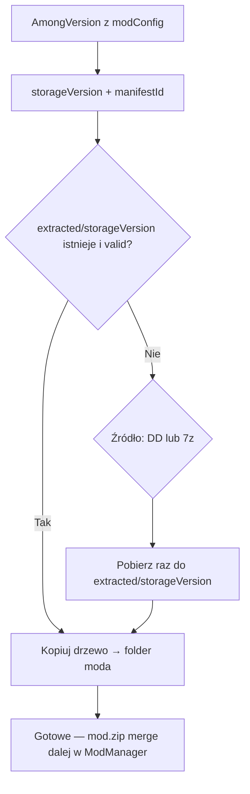
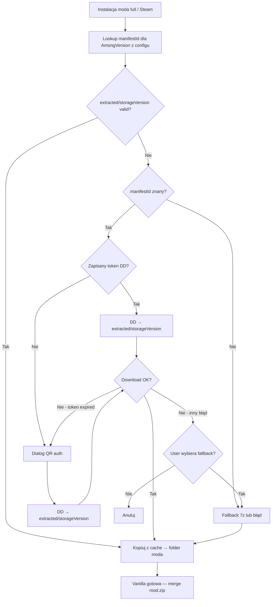
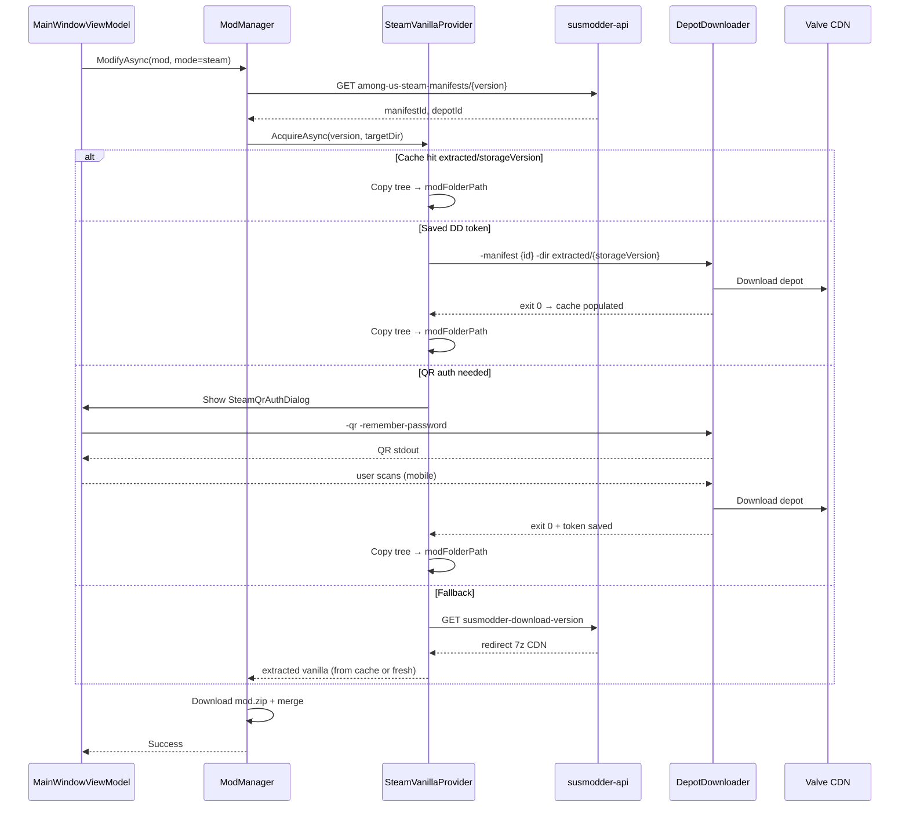

# POC: DepotDownloader jako główne źródło vanilli Steam (7z jako fallback)

> **Status:** POC / plan implementacji  
> **Data:** 2026-06-01  
> **Zakres:** SUSModder 2.x (Avalonia + SUSModder.Core) — ewolucyjna migracja, nie przepisanie na 3.0  
> **Powiązane:** [STEAM_INTEGRATION_POC.md](STEAM_INTEGRATION_POC.md) (2025-11, ogólna analiza), SUSModder 3.0 (`D:\Development\Żródła\SUSModder-3.0-main`), backend Faza E (`among-us-steam-manifests`)

---

## 1. Executive summary

**Cel:** zastąpić pobieranie hostowanych paczek `.7z` (redystrybucja przez CDN SUSModder) legalnym pobieraniem bezpośrednio z CDN Valve przez **DepotDownloader 3.4.0**, z **manifest pinning** z backendu `susmodder-api`. Paczki `.7z` pozostają jako **fallback** (offline, brak Steam, wygasły manifest, błąd auth).

**Kluczowa decyzja projektowa:** nie kopiujemy modelu logowania Steam z SUSModder 3.0 (formularz login/hasło/2FA w aplikacji). Zamiast tego stosujemy **kaskadę źródeł vanilli** bez zbierania haseł Steam oraz **QR auth** jako jedyną interaktywną ścieżkę auth.

**Twardy wymóg wersji:** vanilla **zawsze** musi odpowiadać dokładnie `modConfig.AmongVersion` z configu moda. **Nie** kopiujemy plików z istniejącej instalacji Steam użytkownika (`GameLocator`) — biblioteka Steam może być na innej wersji niż wymaga mod. Jedyna ścieżka na właściwą wersję: **manifest pinning** (DepotDownloader `-manifest {id}`) albo fallback `.7z` o tej samej `storageVersion`.

**Cache per wersja:** wiele modów (np. 3–5) często wymaga tej samej `AmongVersion` — pobieramy/rozpakowujemy vanillę **raz na wersję**, kolejne instalacje kopiują z lokalnego cache (szczegóły §6.4).

**Szacowany effort:** 8–14 dni roboczych (Core + UI + testy manualne + weryfikacja backendu), bez pełnego przepisania `ModManager`.

---

## 2. Dlaczego migrujemy

| Aspekt | Obecny flow (2.x) | Docelowy flow |
|--------|-------------------|---------------|
| Źródło vanilli | `GET /api/susmodder-download-version` → CDN `among-steam/{version}.7z` | DepotDownloader → CDN Valve (depot `945361`) |
| Legalność | Redystrybucja plików gry (szare EULA) | Użytkownik pobiera własną kopię ze Steam |
| Koszt CDN | ~3.6 GB, ~9 plików, rośnie z każdą wersją | Zero transferu vanilli po stronie SUSModder |
| Pinning wersji | Nazwa pliku `.7z` = `storageVersion` | `manifestId` z rejestru backendu |
| Hasło 7z | `SecretProvider.Get7zPassword()` | Niepotrzebne przy DD (fallback nadal używa) |
| Narzędzia | `SharpCompressExtractor` / legacy `7z.exe` | Lazy-download `DepotDownloader.exe` 3.4.0 |

**Among Us wymaga konta Steam z grą w bibliotece** — anonymous download nie działa (AppId `945360`).

---

## 3. Stan zastany w SUSModder 2.x

### 3.1 Flow instalacji Steam (`ModManager.InstallSteamAsync`)

Obecna ścieżka w `SUSModder.Core/GameIntegration/ModManager.cs`:

1. Buduje `storageVersion` z `modConfig.AmongVersion` (np. `2026-3-17` → `2026317`)
2. Pobiera `{BaseUrl}api/susmodder-download-version?version={storageVersion}` z Bearer tokenem — **pomija**, jeśli archiwum już w cache
3. Cache archiwum: `{ModsInstallPath}/Among Us - Vanilla/{storageVersion}.7z`
4. Rozpakowuje 7z hasłem do folderu moda (przy każdej instalacji — brak współdzielonego cache rozpakowanej vanilli)
5. Pobiera mod `.zip` i merguje pliki

**Do poprawy w migracji:** dziś cache obejmuje tylko plik `.7z`; ekstrakcja powtarza się per mod. Docelowo współdzielony cache **rozpakowanej** vanilli per `storageVersion` (§6.4).

### 3.2 Detekcja istniejącej instalacji Steam — poza scope vanilli

`GameLocator.TryFindSteamPath()` nadal przydaje się do **uruchamiania gry** i detekcji platformy, ale **nie** do dostarczenia vanilli przy instalacji moda. Instalacja w Steam library to zwykle *latest* build użytkownika; mod w configu wymaga **konkretnej** wersji (`AmongVersion`). Kopiowanie z library = ryzyko silent mismatch (mod crash, BepInEx incompatibility).

**Decyzja (2026-06-01):** odrzucamy Tier „kopiuj z Steam library”. Każda instalacja full moda pobiera vanillę przez pinned manifest lub fallback 7z.

### 3.3 Epic — wzorzec auth do naśladowania (nie do skopiowania 1:1)

Epic używa **NativeWebView + OAuth** (`EpicAuthDialog`, `EpicVersionManager`) — aplikacja **nie prosi o hasło Epic**. Steam **nie ma publicznego OAuth API** jak Epic, więc parity wymaga innego mechanizmu (QR, import sesji DD).

---

## 4. Co przenosimy z SUSModder 3.0

Kod 3.0 jest referencją implementacyjną, nie docelową architekturą UI.

| Komponent 3.0 | Plik | Werdykt dla 2.x |
|---------------|------|-----------------|
| `DepotDownloaderRunner` | `Sources/Steam/DepotDownloaderRunner.cs` | **PORT** — lazy download, SHA-256, spawn, parsowanie stdout, args |
| `DdAccountConfigWriter` | `Sources/Steam/DdAccountConfigWriter.cs` | **PORT** — cache refresh tokenów DD (`account.config`) |
| `SteamLibraryParser` | `Sources/Steam/SteamLibraryParser.cs` | **OPCJONALNIE** — tylko launch/detect platformy; **nie** używać do vanilli |
| `AmongUsManifestService` | `Services/Manifests/AmongUsManifestService.cs` | **PORT** — lookup manifestId z API |
| `SteamAuthService` (SteamKit2) | `Sources/Steam/SteamAuthService.cs` | **DROP** — duplikuje DD, wymaga credentials, łamie zaufanie UX |
| Modal login/hasło/2FA | `+page.svelte` | **DROP** — audit P1 w 3.0 |
| `-password` w CLI args | `DepotDownloaderRunner.BuildArgs` | **DROP** — hasło nigdy nie idzie do argumentów procesu |
| Sidecar RPC / Tauri | cały stack 3.0 | **N/A** — 2.x zostaje Avalonia MVVM |

### 4.1 Stałe Steam

```
AppId:     945360  (Among Us)
DepotId:   945361  (główny depot Windows/Linux-Proton)
```

---

## 5. Backend — rejestr manifestów Steam

### 5.1 Status endpointów

Endpointy zostały zaprojektowane i zaimplementowane w ramach **Fazy E backendu** (SUSModder 3.0). Kontrakt API jest udokumentowany w `SUSModder-3.0-main/DOC/SPEC/2026-04-19-backend-handoff.md` i przetestowany (`ENDPOINTS_TESTED.md`).

**Uwaga:** snapshot `susmodder-backend-main` w lokalnych źródłach może nie zawierać jeszcze `routes/amongUsManifests.js` — przed implementacją klienta **zweryfikować produkcję** (`GET https://susmodder.app/api/among-us-steam-manifests` z Bearer tokenem).

### 5.2 Endpointy (additive, backward compatible)

| Metoda | URL | Auth | Cel |
|--------|-----|------|-----|
| `GET` | `/api/among-us-steam-manifests` | Bearer (`HTTP_TOKEN`) | Pełny rejestr (~10–30 wpisów) |
| `GET` | `/api/among-us-steam-manifests/:amongVersion` | Bearer | Lookup po `dbValue` (`2026-3-17`) |
| `POST` | `/admin/among-us-steam-manifests` | Bearer (admin) | CRUD — dodawanie nowych wersji |

**Przykład odpowiedzi (lookup):**

```json
{
  "amongVersion": "2026-3-17",
  "epicVersion": "2026.3.17",
  "depotId": 945361,
  "manifestId": "7234589123456789012",
  "buildId": "12345678",
  "releasedAt": "2026-03-17T18:30:00Z",
  "sizeBytes": 261432192
}
```

### 5.3 Mapowanie wersji

Backend już rozwiązuje trzy reprezentacje wersji (`amongUsVersions.js`):

- `dbValue` — kanoniczny w DB modów (`2026-3-17`)
- `epicVersion` — z manifestów Epic (`2026.3.17`)
- `storageVersion` — nazwa pliku 7z (`2026317`)

Klient normalizuje `modConfig.AmongVersion` → `dbValue` → woła lookup manifestu.

### 5.4 Embedded snapshot (offline fallback)

Bundlować minimalny JSON w `SUSModder.Core/Resources/among-us-steam-manifests-snapshot.json` (5–10 ostatnich wersji). Aktualizować przy release aplikacji. Cache na dysku: `%APPDATA%/SUSModder/Cache/steam-manifests.json` (TTL 6h, sync z API).

---

## 6. Architektura docelowa w 2.x

### 6.1 Nowe pliki (propozycja)

```
SUSModder.Core/
├── GameIntegration/
│   ├── ModManager.cs                    (MODIFY — delegacja do VanillaSourceResolver)
│   ├── SteamVanillaProvider.cs          (NEW — orkiestracja DD + fallback 7z + cache)
│   ├── VanillaCacheService.cs           (NEW — extracted/{storageVersion}/ hit/miss)
│   ├── DepotDownloaderRunner.cs         (NEW — port z 3.0)
│   └── DdAccountConfigWriter.cs         (NEW — port z 3.0)
├── Services/
│   └── AmongUsManifestService.cs        (NEW — port z 3.0)
└── Models/
    └── SteamManifestInfo.cs             (NEW)

SUSModder/
├── Views/
│   └── SteamQrAuthDialog.axaml(.cs)     (NEW — QR z stdout DD)
└── ViewModels/
    └── SteamQrAuthDialogViewModel.cs    (NEW)
```

### 6.2 Interface wewnętrzny

```csharp
public interface IVanillaSourceProvider
{
    Task<VanillaAcquireResult> AcquireAsync(
        VanillaAcquireRequest request,
        IProgressReporter progress,
        CancellationToken ct);
}

public record VanillaAcquireRequest(
    string AmongVersion,      // dbValue z modConfig
    string TargetDirectory,   // folder moda przed merge mod.zip
    VanillaSourcePreference Preference = VanillaSourcePreference.Auto);

public enum VanillaSourcePreference { Auto, DepotDownloader, Fallback7z }
```

### 6.3 Integracja z `ModManager`

`InstallSteamAsync` zostaje, ale blok „pobierz + rozpakuj vanilla” zastępujemy:

```csharp
var manifest = await _manifestService.GetSteamManifestForVersionAsync(modConfig.AmongVersion, ct);
var vanillaResult = await _vanillaProvider.AcquireAsync(
    new VanillaAcquireRequest(modConfig.AmongVersion, modFolderPath), progress, ct);

if (!vanillaResult.Success)
    return; // userCallbacks obsłużą błąd

// dalej bez zmian: pobierz mod.zip, rozpakuj, merge
```

Reszta flow (mod zip, retry, progress mapping) **bez zmian**.

### 6.4 Cache vanilli per wersja (decyzja produktowa)

Typowy użytkownik instaluje kilka modów full na **tej samej** wersji Among Us (np. Town of Us + Submerged + Mira HQ — wszystkie `2026-3-17`). Pobieranie ~250 MB i auth Steam przy każdym modzie jest zbędne.

**Zasada:** kluczem cache jest `storageVersion` (jak dziś). Wersje różne → osobne wpisy cache. Ta sama wersja → **jedno pobranie**, wiele kopii do folderów modów.

#### Struktura katalogów

```
{ModsInstallPath}/Among Us - Vanilla/
├── 2026317.7z                          ← archiwum fallback (opcjonalnie, jak dziś)
├── extracted/
│   └── 2026317/                        ← współdzielona rozpakowana vanilla
│       ├── .vanilla-cache.json         ← metadane: amongVersion, manifestId, source, fetchedAt
│       ├── Among Us.exe
│       └── Among Us_Data/
└── ...
```

#### Flow `SteamVanillaProvider.AcquireAsync`



1. **Cache hit** — katalog `extracted/{storageVersion}/` istnieje, `Among Us.exe` obecny, `.vanilla-cache.json` zgodny z oczekiwanym `manifestId` (jeśli znany) → **kopiuj** do `TargetDirectory` (folder moda). Brak sieci, brak auth Steam.
2. **Cache miss** — pobierz przez DD (`-dir extracted/{storageVersion}`) lub fallback 7z (extract do tego samego katalogu), zapisz metadane, potem kopiuj do folderu moda.
3. **Walidacja** — minimalna: obecność `Among Us.exe` + `Among Us_Data/`. Opcjonalnie: porównanie `manifestId` w `.vanilla-cache.json` z API (invalidacja przy zmianie rejestru).

#### Źródła a cache

| Źródło | Co cache'ujemy | Kolejny mod (ta sama wersja) |
|--------|----------------|------------------------------|
| DepotDownloader | `extracted/{storageVersion}/` | Kopia lokalna (~kilka s) |
| Fallback 7z | `{storageVersion}.7z` + `extracted/{storageVersion}/` | Bez ponownego downloadu; extract tylko przy pierwszym modzie |
| Cache hit | — | Tylko kopia do folderu moda |

#### Różnica względem 2.x

| | 2.x (dziś) | Docelowo |
|---|-----------|----------|
| Cache `.7z` | Tak | Tak (fallback) |
| Cache rozpakowanej vanilli | Nie — extract per mod | **Tak** — `extracted/{storageVersion}/` |
| DD depot | N/A | Download prosto do `extracted/` |

#### Czyszczenie

- Settings → „Wyczyść cache vanilli” — usuwa `Among Us - Vanilla/extracted/` i opcjonalnie `.7z`
- Przy uninstall moda **nie** usuwamy cache wersji (inne mody mogą go używać)
- Szacunek miejsca: ~250 MB × liczba **unikalnych** wersji AU (zwykle 1–3), nie × liczba modów

---

## 7. Steam Auth — problem i rekomendowane rozwiązanie

> **To jest główny powód porzucenia podejścia z 3.0.** Audit 3.0 (`2026-04-23-audit-bughunt-i-prompty.md`) jednoznacznie wskazuje: *„app-owned pola login/hasło to P1 do usunięcia”*.

### 7.1 Dlaczego 3.0 nie działa produktowo

| Problem | Skutek |
|---------|--------|
| Formularz username/password w UI | Użytkownik nie ufa aplikacji; wygląda jak phishing |
| Hasło w argumentach CLI (`-password`) | Widoczne w Process Explorer / logach |
| Dwa systemy auth (SteamKit2 + DD) | Niespójność tokenów, złożoność |
| Ręczny formularz 2FA | Friction, brak parity z Epic WebView |
| `steam.authorize` = stub | Import sesji Steam Client niedokończony |

### 7.2 Ograniczenia platformy Steam

Steam **nie udostępnia** publicznego OAuth flow dla third-party downloaderów (w przeciwieństwie do Epic). Dostępne mechanizmy **pobierania konkretnej wersji**:

1. DepotDownloader z `-manifest {manifestId}` — pinned build z CDN Valve
2. QR auth przez aplikację mobilną Steam (`DepotDownloader -qr`)
3. Refresh token z poprzedniej sesji DD (`-username` + `-remember-password`, bez hasła)
4. Fallback `.7z` z CDN SUSModder (ta sama `storageVersion` co dziś)
5. Tradycyjny login+hasło+2FA (SteamKit2 / DD) — **odrzucamy w UI**
6. SteamCMD + email codes — gorsze UX, rozważyć tylko jako hidden fallback dev

**Nie używamy:** kopiowania z biblioteki Steam — nie gwarantuje wersji z configu.

**Nie ma** odpowiednika `legendary auth --import` dla Steam Client w oficjalnym API.

### 7.3 Rekomendacja: kaskada źródeł vanilli (bez hasła w aplikacji)



#### Tier 1 — DepotDownloader z zapisanym tokenem

- **Warunek:** `DdAccountConfigWriter.HasAnyToken()` == true
- **Args:** `-app 945360 -depot 945361 -manifest {id} -dir {path} -username {saved} -remember-password`
- **Auth:** brak interakcji użytkownika
- **Token expired:** przejście do Tier 2

#### Tier 2 — QR auth (jedyne interaktywne logowanie)

- **UI:** `SteamQrAuthDialog` — **nie** formularz hasła
- **Proces:** spawn DD z `-qr -remember-password` (bez `-username`)
- **Parsowanie:** czytaj stdout, wykryj blok ASCII QR (`█`), renderuj w dialogu + instrukcja „Zeskanuj w aplikacji Steam”
- **2FA:** obsługiwane przez Steam Mobile App w ramach QR flow — **bez** osobnego pola 2FA w SUSModder
- **Po sukcesie:** `DdAccountConfigWriter.BackupToCache()`, kontynuuj download z `-manifest`

**Ważne ograniczenie DD 3.4.0:** `-qr` i `-username` **nie mogą** być użyte razem. Flow first-time vs returning musi to respektować.

#### Tier 3 — Fallback 7z (obecny system)

- **Warunki:** user odmawia QR / brak manifestId w API / manifest niedostępny w CDN Valve / błąd sieci DD
- **Akcja:** obecny `susmodder-download-version?version={storageVersion}` + `SharpCompressExtractor` — **ta sama wersja** co w configu moda
- **Auth:** tylko Bearer `HTTP_TOKEN` (już mamy)
- **UX:** komunikat: *„Nie udało się pobrać ze Steam. Używam kopii zapasowej SUSModder (wersja {AmongVersion}).”*
- Po extract do `extracted/{storageVersion}/` kolejne mody na tej wersji korzystają z cache (§6.4)

### 7.4 Macierz decyzji auth

| Opcja | Hasło w app | UX | Implementacja | Werdykt |
|-------|-------------|-----|---------------|---------|
| Kopiowanie z Steam library | Nie | Szybkie, ale **zła wersja** | GameLocator | **ODRZUĆ** — brak version pin |
| Formularz login/hasło/2FA (3.0) | Tak | Zły / podejrzany | Gotowe w 3.0 | **ODRZUĆ** |
| SteamKit2 w Core | Tak (pośrednio) | Średni | Duży pakiet, konflikt AOT | **ODRZUĆ** |
| QR auth (-qr) | Nie | Dobry (mobile) | Port stdout parser | **MVP — primary auth** |
| Import sesji Steam Client | Nie | Idealny | Brak oficjalnego API, reverse engineering | **POST-MVP research** |
| WebView Steam login | Nie | Epic-like | Steam nie ma OAuth dla depot | **Niemożliwe** |
| Tylko 7z fallback | Nie (token HTTP) | Znany | Już działa | **Fallback** |
| SteamCMD email codes | Tak (prompt) | Słaby | Osobny tool | **Opcjonalny dev fallback** |

### 7.5 Bezpieczeństwo tokenów

- **Hasło Steam:** nigdy nie persistować, nigdy nie przekazywać do UI ViewModel dłużej niż lifetime procesu DD (przy QR — w ogóle nie dotyczy)
- **Refresh token DD:** `%LOCALAPPDATA%/SUSModder/steam-session/account.config` (backup cache, port z 3.0)
- **Opt-out:** Settings → „Zapomnij sesję Steam” → `DdAccountConfigWriter.CleanCorrupt()` + usuń cache
- **Default:** zapamiętywanie tokenu **ON** (decyzja Q05-2 z POC 3.0 — kluczowe dla UX powtarzalnych instalacji)

### 7.6 Propozycja UI (`SteamQrAuthDialog`)

Wzorować layout na `EpicAuthDialog`, ale **zamiast WebView**:

```
┌─────────────────────────────────────────────────────┐
│  Logowanie Steam (wymagane do pobrania gry)         │
├─────────────────────────────────────────────────────┤
│  SUSModder nie prosi o hasło Steam.                 │
│  Zeskanuj kod w aplikacji Steam na telefonie.       │
│                                                      │
│  ┌─────────────────┐                                │
│  │   [QR CODE]     │  ← render z stdout DD          │
│  │   ASCII/Bitmap  │                                │
│  └─────────────────┘                                │
│                                                      │
│  Status: Oczekiwanie na skan…                       │
│                                                      │
│  [Anuluj]  [Użyj kopii zapasowej (7z) zamiast tego] │
└─────────────────────────────────────────────────────┘
```

Opcjonalnie POST-MVP: konwersja URL QR z logów DD do bitmapy (`QRCoder`) zamiast ASCII art.

---

## 8. Flow instalacji end-to-end



---

## 9. Plan implementacji

### Faza 0 — Weryfikacja (0.5–1 dzień)

- [ ] Potwierdzić na produkcji/staging działanie `GET /api/among-us-steam-manifests`
- [ ] Manualny test DD 3.4.0: `-qr -remember-password -app 945360 -depot 945361 -manifest {id}`
- [ ] Sprawdzić ile starych manifestów Among Us jest jeszcze dostępnych w CDN Valve
- [ ] Zdecydować czy rejestr manifestów w DB jest już zseedowany (23 wpisy z planu Fazy E)

### Faza 1 — Core bez UI (2–3 dni)

- [ ] Port `DepotDownloaderRunner`, `DdAccountConfigWriter` do `SUSModder.Core`
- [ ] Port `AmongUsManifestService` (HTTP + cache + snapshot fallback)
- [ ] `SteamVanillaProvider`: cache `extracted/{storageVersion}/` + copy do folderu moda (§6.4)
- [ ] `VanillaCacheService` — hit/miss, `.vanilla-cache.json`, walidacja
- [ ] Testy jednostkowe: `BuildArgs`, normalizacja wersji, manifest lookup (mock HTTP)
- [ ] Feature flag w `user_settings`: `vanillaSourcePreference` = `auto` | `depotdownloader` | `legacy7z`

### Faza 2 — QR auth UI (2–3 dni)

- [ ] `SteamQrAuthDialog` + integracja z `IUserInteraction`
- [ ] Tier 1 + Tier 2 w `SteamVanillaProvider`
- [ ] Mapowanie błędów DD → komunikaty PL (port `ParseDdError` z 3.0)
- [ ] Timeout procesu: **nie 60s** (za mało na download) — osobno timeout auth (120s) i download (30min)

### Faza 3 — Integracja ModManager (1–2 dni)

- [ ] Podmiana bloku vanilla w `InstallSteamAsync`
- [ ] Progress mapping: DD stdout → 10–60% paska instalacji
- [ ] Retry: expired token → QR dialog; manifest missing → 7z fallback z potwierdzeniem

### Faza 4 — Polish (1–2 dni)

- [ ] Settings: „Zapomnij sesję Steam”, „Preferuj pobieranie ze Steam”
- [ ] Telemetria: `vanilla_source_used` (cache_hit | depotdownloader | fallback7z) — bez username
- [ ] Dokumentacja admin: jak dodać nowy manifest po update Among Us
- [ ] Aktualizacja CLAUDE.md

### Faza 5 — POST-MVP

- [ ] Research: import sesji ze Steam Client (bez QR)
- [ ] SteamCMD fallback (opcjonalny, ukryty)
- [ ] susadmin UI dla CRUD manifestów (jeśli brak w backendzie)

---

## 10. Ryzyka

| Ryzyko | Prawdop. | Mitygacja |
|--------|----------|-----------|
| Valve usuwa stary manifest z CDN | Średnie | Fallback 7z; komunikat „mod wymaga aktualizacji” |
| Brak manifestId w API dla nowej wersji AU | Wysokie (po każdym patchu) | Admin workflow + telemetry `buildId`; tymczasowo 7z |
| QR auth nie działa (brak telefonu) | Niskie | Fallback 7z; instrukcja alternatywna |
| DD wolniejszy niż CDN 7z | Pewne | Akceptowalne (~250 MB); progress bar |
| AV blokuje DD.exe | Średnie | Lazy download + SHA-256; podpis opcjonalny |
| Użytkownik bez gry na Steam | Pewne | DD zwróci AccessDenied → komunikat + link do sklepu |
| `-qr` + `-username` conflict w DD | Pewne | Osobne code paths (patrz §7.3) |

---

## 11. Kryteria akceptacji POC → implementacja

- [x] Zdefiniowana kaskada źródeł vanilli z DD jako primary
- [x] Odrzucone kopiowanie z Steam library — wymóg exact version z configu
- [x] Cache rozpakowanej vanilli per `storageVersion` — współdzielony między modami
- [x] 7z jako fallback, nie usuwany w MVP
- [x] Auth bez formularza login/hasło w aplikacji
- [x] Mapowanie na istniejący `ModManager` (ewolucja, nie rewrite)
- [x] Kontrakt API manifestów opisany
- [ ] Potwierdzenie działania API na produkcji (Faza 0)
- [ ] Spike QR dialog z prawdziwym DD (Faza 0)
- [ ] Decyzja product owner: default `auto` vs wymuszony DD

---

## 12. Otwarte pytania do decyzji

1. **Czy fallback 7z wymaga explicit consent** za każdym razem, czy tylko przy pierwszym użyciu?
2. **Linux** — czy MVP obejmuje DD linux-x64, czy tylko Windows w pierwszej iteracji?
3. **Backend lokalny** — czy `susmodder-backend-main` w Twoim fork użytkownika ma już merge Fazy E, czy trzeba deploy osobno?

---

## 13. Różnica względem POC 2025-11 (`STEAM_INTEGRATION_POC.md`)

| Aspekt | POC 2025-11 | Ten dokument (2026-06) |
|--------|-------------|------------------------|
| Domyślna metoda | SteamCMD | DepotDownloader |
| Auth primary | QR (DD opt-in) | QR (DD default); bez copy z library |
| Wersja vanilli | Nie precyzowane | **Zawsze exact** — manifest pin lub 7z tej samej wersji |
| Fallback | SteamCMD | **7z CDN (istniejący)** |
| Manifesty | „TBD backend” | API `among-us-steam-manifests` (Faza E) |
| Architektura | Nowy `SteamVersionManager` | Ewolucja `ModManager` + `SteamVanillaProvider` |
| Steam login | QR lub SteamCMD email | **Bez hasła w UI**; odrzucenie modelu 3.0 |
| NuGet DDLib | Tak (1.1.1) | **Nie** — spawn binary 3.4.0 (decyzja 3.0, unofficial fork) |

---

## 14. Referencje

- `SUSModder.Core/GameIntegration/ModManager.cs` — obecny flow 7z
- `SUSModder.Core/GameIntegration/GameLocator.cs` — detekcja Steam
- `SUSModder/Views/EpicAuthDialog.axaml.cs` — wzorzec dialogu auth (WebView)
- `D:\Development\Żródła\SUSModder-3.0-main\src\SUSModder.Core\Sources\Steam\` — referencja implementacji DD
- `D:\Development\Żródła\SUSModder-3.0-main\DOC\POC\SUSModder-3.0\05-pobieranie-gry-steam.md` — pełna spec 3.0
- `D:\Development\Żródła\SUSModder-3.0-main\DOC\PLAN\archive\2026-04-23-audit-bughunt-i-prompty.md` — audit auth UX
- [DepotDownloader 3.4.0 releases](https://github.com/SteamRE/DepotDownloader/releases/tag/DepotDownloader_3.4.0)
- [DepotDownloader authentication docs](https://deepwiki.com/SteamRE/DepotDownloader/4.1-authentication)

---

## Rejestr zmian

| Data | Wersja | Zmiana |
|------|--------|--------|
| 2026-06-01 | 1.0 | POC migracji DD do 2.x; kaskada auth bez hasła; odrzucenie modelu 3.0 |
| 2026-06-01 | 1.1 | Odrzucono kopiowanie z Steam library — wymóg exact version z configu (manifest / 7z) |
| 2026-06-01 | 1.2 | Cache rozpakowanej vanilli per storageVersion — współdzielony między modami (§6.4) |
